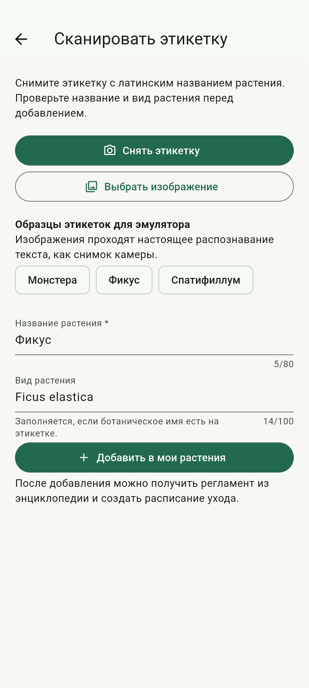
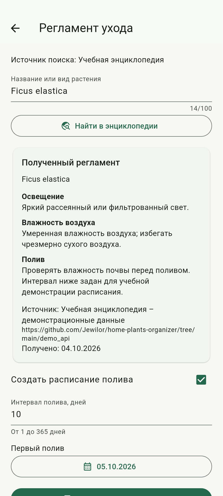
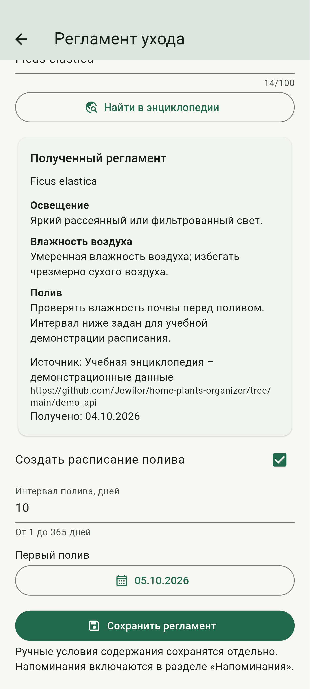
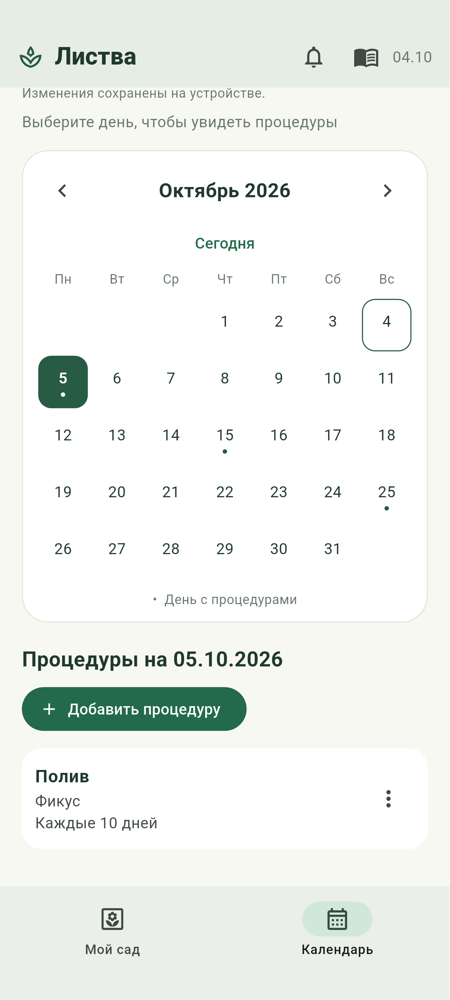
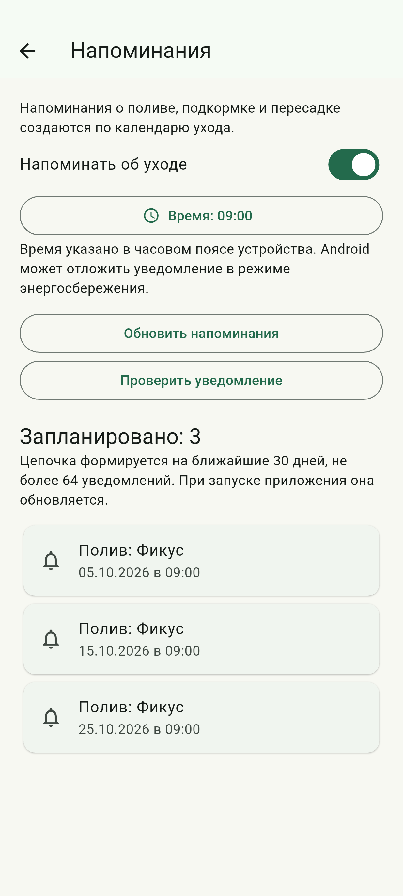
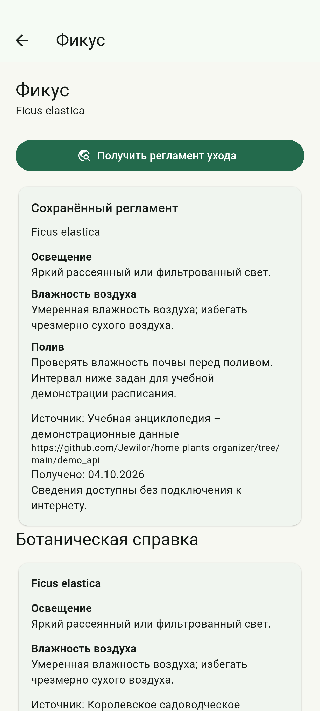
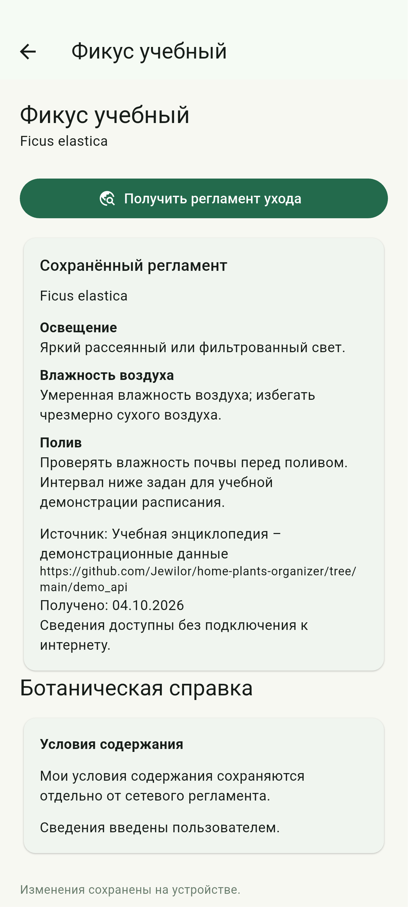
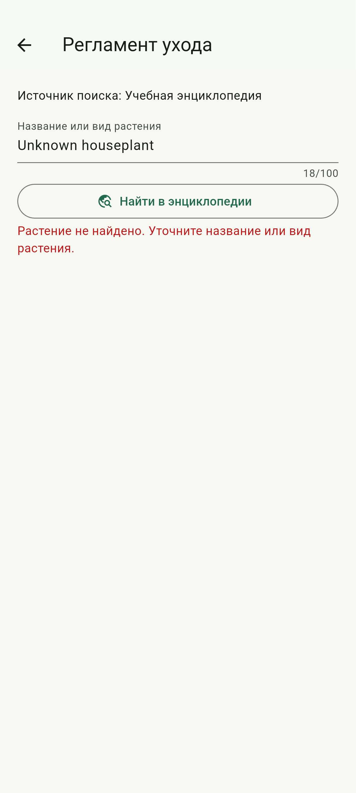
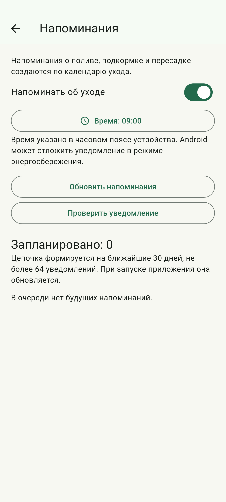
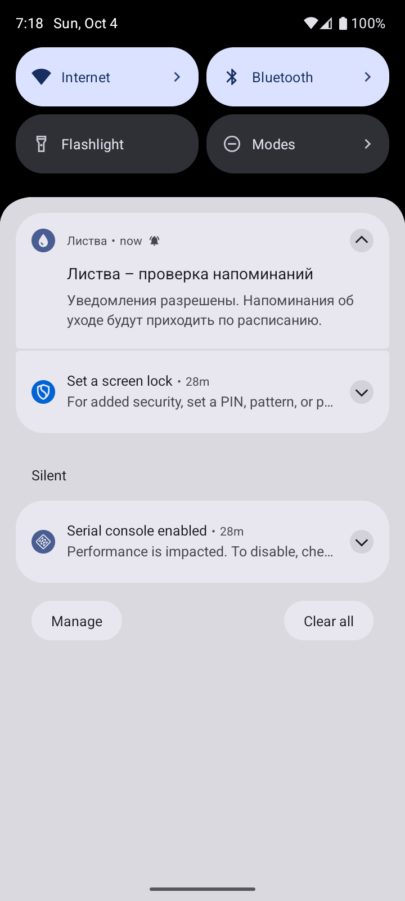

# Лабораторная работа №4

Сетевое взаимодействие на основе REST и реактивное обновление интерфейса средствами Flutter.

Выполнил: студент группы ИТИ-41 Заяц М. С.

Принял: старший преподаватель Семенченя Т. С.

**Цель работы:** освоить асинхронное взаимодействие мобильного приложения с сетевой службой, преобразование полученного ответа в объекты предметной области и реактивное обновление интерфейса. Реализовать получение регламента ухода за растением, его долговременное хранение и создание локальных напоминаний.

**Задание:** выполнить часть варианта № 7 «Мобильный органайзер домашних растений», выделенную голубым цветом. Приложение должно передавать распознанное название растения в энциклопедию через программный интерфейс REST, получать основной регламент ухода, сохранять его в базе данных и автоматически формировать локальные напоминания.

Требования адаптированы к Flutter и языку Dart. Вместо URLSession применён клиент пакета http и асинхронные методы Future с async и await. Реактивное обновление состояния выполнено средствами ChangeNotifier и ListenableBuilder вместо Combine и SwiftUI. Для системных уведомлений Android использован пакет flutter_local_notifications. Исходный код размещён в репозитории GitHub: [https://github.com/Jewilor/home-plants-organizer](https://github.com/Jewilor/home-plants-organizer). Код новых и изменённых файлов приведён полностью в приложении А, в том числе файлы моделей, сетевого взаимодействия, хранения, представлений и автоматизированной проверки.

**Ход выполнения работы:** изучена часть задания, относящаяся к получению регламента ухода через сеть. Разработан путь обработки данных от распознавания этикетки до сохранения справки и планирования процедур. Сохранены функции предыдущих работ: редактирование растений, календарь, отметки выполнения, журнал ухода и справочники. Пользовательские условия содержания и сведения, загруженные из энциклопедии, разделены, чтобы повторный сетевой поиск не изменял введённый пользователем текст.

Разработан интерфейс PlantEncyclopedia, отделяющий сетевую службу от представлений. Класс HttpPlantEncyclopedia отправляет запрос GET, проверяет код ответа, декодирует текст UTF-8 и преобразует JSON в модель CareGuide. Модель содержит вид растения, условия освещения, влажность воздуха, рекомендации по поливу, предлагаемый интервал, источник и дату получения. До сохранения проверяются обязательные поля, допустимая длина текста, адрес источника и диапазон интервала. Реализация модели и клиента представлена в листингах А.2 и А.6.

Для воспроизводимой демонстрации подготовлен учебный набор сведений о комнатных растениях. Файл опубликован в репозитории и получается через REST-интерфейс GitHub. Запрос содержит параметр q с названием растения. Данный интерфейс возвращает весь учебный набор, поэтому точное сопоставление названия с русскими и латинскими обозначениями выполняется в приложении. Это настоящий сетевой запрос к демонстрационным данным, а не запрос к Perenual. Использование подобного учебного источника разрешено общими требованиями задания. Данные источника приведены в листинге А.24.

Дополнительно предусмотрено подключение Perenual через параметр сборки PERENUAL_API_KEY. В этом режиме клиент сначала запрашивает список видов по названию, выбирает единственное точное совпадение и получает подробные сведения по идентификатору вида. Предложенный интервал полива может быть уточнён перед сохранением. Если сервис не предоставляет сведения или интервал, приложение не подставляет вымышленные значения. Настоящий Perenual без ключа доступа не проверялся; соответствующая последовательность запросов проверена на контролируемых ответах в автоматизированных проверках.

Для соединения распознавания и сетевого поиска изменён экран добавления по этикетке. После распознавания пользователь проверяет название и вид растения. При подтверждении создаётся карточка и открывается экран получения регламента. В запрос передаётся ботаническое имя, если оно указано, либо обычное название. Цена с этикетки не используется. При проверке на эмуляторе выполнено настоящее распознавание встроенного изображения средствами ML Kit. Результат распознавания Ficus elastica и подготовка карточки представлены на рисунке 1.

Для управления загрузкой разработан класс CareGuideViewModel. Перед отправкой запроса он устанавливает состояние ожидания и сообщает об изменении через notifyListeners. После получения результата сохраняет модель регламента либо понятное сообщение об ошибке. ListenableBuilder перестраивает соответствующий участок интерфейса. Номер текущего запроса исключает применение запоздалого ответа предыдущего поиска; после закрытия экрана результат также не изменяет состояние. Соответствующая реализация приведена в листингах А.13 и А.15. Полученные по сети условия освещения, влажности и полива с обозначением источника представлены на рисунке 2.

На экране регламента добавлена настройка первой даты и интервала полива. Значение интервала первоначально заполняется из ответа службы, затем пользователь может его изменить. При включённом признаке создания расписания приложение формирует повторяющуюся процедуру автоматически по выбранным параметрам. Для демонстрации установлен интервал 10 дней, первый полив назначен на 05.10.2026. Можно сохранить только справку, отключив создание расписания. Настройка расписания перед сохранением представлена на рисунке 3.

Для произвольного интервала расширена модель CareProcedure. Помимо еженедельного повторения введено поле repeatEveryDays. Метод occursOn определяет принадлежность выбранной даты серии по разности календарных дней, приведённых к UTC, и остатку от деления на интервал. Такое вычисление не зависит от продолжительности местных суток при переводе часов. Ранее созданные еженедельные процедуры сохраняют поведение с интервалом семь дней. Формы ручного добавления и изменения процедур также поддерживают произвольный интервал. Реализация приведена в листингах А.4 и А.20. Созданная серия полива с отметками на 05.10.2026, 15.10.2026 и 25.10.2026 представлена на рисунке 4.

Метод applyCareGuide модели GardenViewModel сохраняет полученную справку и, при выборе расписания, заменяет будущий план полива данного растения. Выполненные действия остаются в журнале. Подкормки и пересадки сохраняются без изменения. Названия в календаре берутся по идентификатору растения, поэтому переименование карточки отражается во всех процедурах. При отметке выполнения конкретная дата исключается из будущей очереди; повторение остаётся привязанным к первоначальной дате начала. Алгоритмы управления состоянием и пересечением повторяющихся серий приведены в листинге А.14.

Разработан отдельный планировщик напоминаний. Он рассматривает ближайшие 30 дней, исключает выполненные даты и отсутствующие растения, упорядочивает будущие события и ограничивает очередь 64 уведомлениями. Время выбирается пользователем в разделе «Напоминания». Переключатель запрашивает разрешение Android, после чего зарегистрированные события отображаются в интерфейсе. При проверке фактические идентификаторы и заголовки из pendingNotificationRequests сопоставлены с расчётной очередью приложения. Для показанной серии зарегистрированы 3 уведомления на девять часов. Раздел настройки и зарегистрированные даты представлены на рисунке 5.

Класс AndroidReminderService получает часовой пояс устройства, использует полную базу timezone, включающую обозначения GMT и UTC, и вызывает zonedSchedule для будущих дат. В конфигурацию Android добавлены разрешения на уведомления и обработчики восстановления событий после перезагрузки устройства или обновления приложения. Использован режим inexactAllowWhileIdle, поэтому отдельное разрешение на точные будильники не требуется. Операционная система может задерживать доставку в режиме энергосбережения. Системная очередь обновляется после успешной записи базы данных, а ошибки уведомлений отображаются отдельно от ошибок сохранения. Реализация приведена в листингах А.3, А.7, А.8, А.21, А.22 и А.23.

Для долговременного хранения увеличена версия SQLite до трёх. При обновлении базы добавляются поле repeat_every_days и таблица care_guides с внешним ключом на растение. Справка сериализуется в JSON; настройки времени и включения напоминаний хранятся вместе с состоянием приложения. Сохранение выполняется в транзакции. Изменение схемы не удаляет имеющиеся карточки, журнал и расписание предыдущей версии. Для связи модели состояния с репозиторием расширен GardenSnapshot. Реализация хранения приведена в листингах А.5 и А.9. После записи справка отображается в карточке и доступна без повторного запроса; результат представлен на рисунке 6.

Для проверки долговременного хранения процесс приложения остановлен, затем выполнен новый запуск с отдельным проверочным каталогом данных. Восстановлены карточка «Фикус учебный», справка для Ficus elastica, интервал 10 дней и включённые напоминания. Повторно проверено соответствие системной очереди календарю. Введённые вручную условия содержания также восстановлены и показаны отдельным блоком. Экран после повторного запуска представлен на рисунке 7.

Предусмотрена обработка отказа доступа, превышения лимита запросов, отсутствия результата, превышения времени ожидания и некорректного ответа. Срок ожидания одного запроса составляет 12 секунд. При неизвестном названии выводится предложение уточнить вид растения. Такой результат не удаляет уже сохранённую справку и не изменяет расписание. Для проверки использовано отсутствующее в учебном наборе название Unknown houseplant. Сообщение при отсутствии совпадения представлено на рисунке 8.

Проверена согласованность системных напоминаний с изменениями коллекции. После переименования растения заголовки ожидающих уведомлений содержат новое название. После удаления карточки удаляются её процедуры и справка, а будущие уведомления отменяются. В проверке сравнивались данные SQLite и фактические записи Android, а не только надпись в интерфейсе. Пустая очередь после удаления растения представлена на рисунке 9.

Для самостоятельной проверки разрешений добавлена кнопка «Проверить уведомление». Она отправляет настоящее системное уведомление, которое появляется в панели Android. Это проверка немедленной доставки; будущие события отдельно проверены по системной очереди, без утверждения об их доставке до назначенной даты. Результат проверки системного уведомления представлен на рисунке 10.

Выполнены автоматизированные проверки сетевых ответов, ошибок, защиты от запоздалого результата, повторяющихся процедур, очереди напоминаний, отказа в разрешении, сохранения и обновления схемы SQLite. Проверены часовые пояса GMT, UTC и Europe/Minsk, а также отображение форм при ограниченной ширине экрана. Полный набор содержит 53 проверки и завершён успешно. Проверка flutter analyze не выявила замечаний. Отдельные сценарии на эмуляторе проверяют настоящее распознавание, HTTP, базу данных, системные уведомления и новый запуск процесса. Код этих проверок приведён в листингах А.25, А.26, А.27 и А.28. Для запуска подготовлен обновлённый установочный пакет Android версии 1.3.0.

**Ответы на контрольные вопросы:** для выполнения базового запроса URLSession сначала создаётся URL, при необходимости настраивается URLRequest с методом и заголовками, затем создаётся задача dataTask и запускается через resume. В обработчике проверяются транспортная ошибка и HTTPURLResponse, после чего данные декодируются в модель. В варианте с async и await результат получается через data(for:) либо data(from:). В данном проекте аналогичная последовательность выполняется через await client.get, проверку statusCode и jsonDecode.

Combine предназначен для обработки асинхронных последовательностей значений и завершений. Издатель Publisher предоставляет значения, подписчик Subscriber принимает их, а Subscription связывает стороны и управляет спросом и отменой. Операторы преобразуют, объединяют и фильтруют последовательности. Во Flutter использован более простой наблюдаемый объект ChangeNotifier: он сообщает об изменении состояния, а ListenableBuilder обновляет представление. Это адаптация реактивного принципа, а не использование самого Combine.

Метод URLSession.dataTaskPublisher(for:) создаёт издателя сетевого запроса. Его значение содержит Data и URLResponse, а тип ошибки определяется как URLError. Код HTTP с ошибкой сам по себе не обязательно приводит к завершению такого издателя ошибкой: статус требуется проверить явно. В разработанном клиенте аналогичная проверка выполнена до преобразования ответа в модель.

Для преобразования бинарного ответа в объекты цепочка Combine проверяет HTTPURLResponse через tryMap, выделяет данные и применяет decode(type:decoder:) с JSONDecoder. Сетевой слой возвращает типизированный издатель, а модель представления получает подготовленные объекты через подписку. В проекте преобразование сосредоточено в HttpPlantEncyclopedia и CareGuide.fromJson, поэтому представление не зависит от структуры сырого JSON.

AnyCancellable представляет отменяемую подписку с автоматической отменой при освобождении объекта. При использовании sink или assign полученное значение сохраняют в свойстве либо коллекции модели представления. Если последний сильный владелец AnyCancellable исчезает, подписка отменяется и сетевой издатель может прекратить запрос. Во Flutter длительность существования клиента связана с GardenResources, а CareGuideViewModel при освобождении запрещает применение позднего ответа. Future при этом автоматически не отменяется, что отличается от поведения AnyCancellable.

Оператор subscribe(on:) задаёт планировщик для подписки и связанных обращений к вышестоящему издателю, а receive(on:) переносит доставку последующих значений и завершения на выбранный планировщик. Для обновления SwiftUI обычно выбирается главный поток. Сетевой ввод-вывод Dart выполняется асинхронно, а изменения ChangeNotifier происходят в основном изоляте. Поэтому интерфейс обновляется без блокирующего ожидания сети; вычислительно сложную обработку при необходимости следует вынести в отдельный изолят.

В Combine транспортные ошибки поступают как завершение с ошибкой, а ошибочный код HTTP можно преобразовать в ошибку через tryMap. Оператор catch позволяет заменить ошибку подходящим издателем, retry повторяет подписку, а sink получает окончательный результат. Повторение имеет смысл только для подходящих временных отказов и не должно бесконечно повторять неверный запрос. В приложении ошибки преобразуются в EncyclopediaException, а повторное обращение выполняется по явному действию пользователя.

Для поиска по мере ввода в Combine применяют debounce, ожидающий паузу после последнего изменения, и removeDuplicates, исключающий соседние равные значения. Преобразование текста в сетевого издателя и switchToLatest позволяют принимать результат последнего поиска. В выполненной работе поиск запускается при открытии экрана или нажатием кнопки, поэтому задержка ввода не применяется. Защита от устаревшего ответа реализована сравнением номера завершившегося запроса с номером текущего.

Свойство класса модели представления становится наблюдаемым источником через @Published, а сама модель соответствует ObservableObject. Издатель свойства доступен через запись с символом доллара перед его именем; SwiftUI наблюдает изменения модели через соответствующие средства владения и наблюдения. Во Flutter после изменения guide, loading или error вызывается notifyListeners, а ListenableBuilder получает уведомление и перестраивает интерфейс.

Combine описывает обработку потока значений и событий декларативной цепочкой операторов, удобной для объединения нескольких изменяющихся источников. Async и await позволяют последовательно записать ожидание отдельных асинхронных операций и обработку исключений. Структурированная конкурентность Swift определяет связи между задачами и распространение отмены; одна только запись async и await не создаёт реактивный поток. В данном проекте Future применён для одного результата сетевого поиска, а ChangeNotifier обеспечивает наблюдение за состоянием этого результата.

Вывод: реализовано асинхронное получение регламента ухода через REST, проверка и преобразование ответа, реактивное обновление интерфейса, сохранение справки в SQLite и автоматическое создание повторяющегося расписания. Добавлены локальные напоминания Android с учётом разрешения и часового пояса, согласованные с выполнением, переименованием и удалением процедур. Получение учебных данных через сеть, распознавание этикетки, сохранение, восстановление и системная очередь проверены на эмуляторе. Освоено разделение сетевого взаимодействия, хранения данных, модели представления и отображения в приложении Flutter.