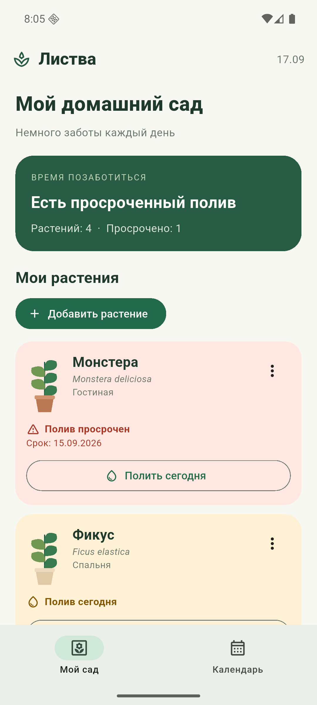
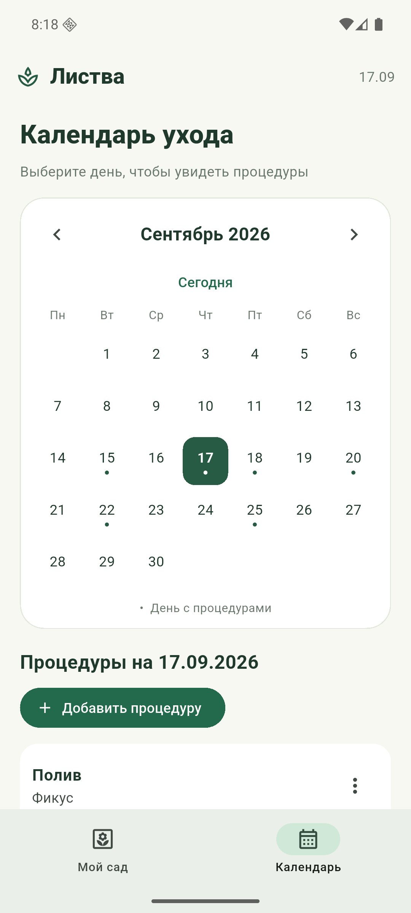
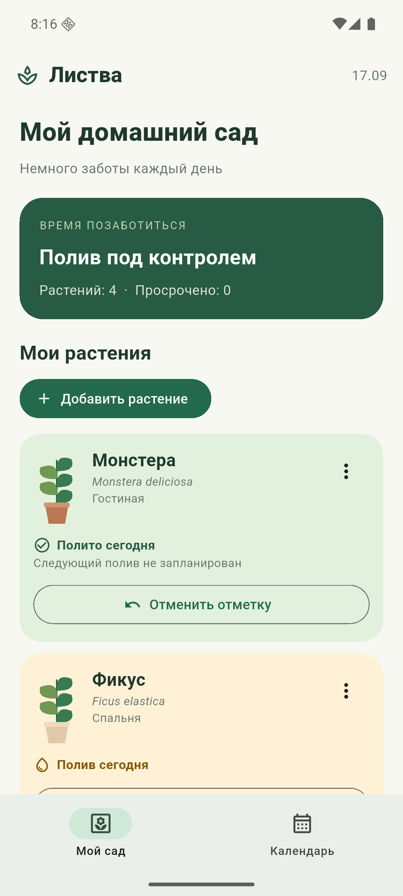

# Отчёт по лабораторной работе № 1

## Мобильный органайзер домашних растений

Выполнил: студент группы ИТИ-41 Заяц М. С.

Вариант 7.

## Цель работы

Целью лабораторной работы являлось создание функциональной части мобильного приложения для каталогизации комнатных растений, просмотра процедур ухода и контроля сроков полива. При реализации использовались язык Dart и программная платформа Flutter. Интерфейс приложения выполнен на русском языке. В работе применена архитектура Model–View–ViewModel: модель хранит сведения о растениях и процедурах, объект представления модели изменяет состояние приложения, а представление отображает это состояние средствами виджетов Flutter.

## Ход выполнения работы

В ходе выполнения работы был создан проект «Мобильный органайзер домашних растений» для варианта 7. В качестве демонстрационной основы были подготовлены записи о комнатных растениях. Для каждой записи задаются название, вид растения, помещение и дата следующего полива. На первом этапе сведения хранятся в оперативной памяти приложения, поэтому после полного перезапуска демонстрационные изменения не сохраняются. Такое ограничение связано с тем, что постоянное хранилище относится к последующей лабораторной работе.

Ход выполнения работы: был реализован главный экран «Мой сад» с перечнем комнатных растений. Каждая карточка содержит название растения, его вид, помещение, срок процедуры и действие для отметки полива. Срок сравнивается с текущей календарной датой. При просроченном сроке карточка получает светло-красный фон и текстовое предупреждение «Полив просрочен». Для срока, совпадающего с текущим днём, используется янтарный фон, а будущий срок отображается зелёным цветом. Результат выполнения каталога представлен на рисунке 1.

Ход выполнения работы: для управления составом каталога была добавлена форма создания растения. В форме предусмотрен ввод названия, вида и помещения, а также возможность сразу запланировать дату первого полива. Перед сохранением выполняется проверка обязательного названия. После сохранения новая запись появляется в списке растений, а запланированная процедура связывается с созданным растением. Результат выполнения формы представлен на рисунке 2.

Ход выполнения работы: для изменения ранее созданной записи была реализована форма редактирования растения. При открытии формы поля заполняются существующими значениями. После изменения названия обновлённые сведения используются во всех связанных частях приложения, включая календарь процедур. Результат выполнения редактирования представлен на рисунке 3.

Ход выполнения работы: была создана вкладка «Календарь». В календаре можно выбрать день, перейти к следующему или предыдущему месяцу и вернуться к текущей дате. Дни, для которых назначены процедуры, имеют визуальную отметку. После выбора даты ниже календаря выводится перечень процедур с указанием растения и вида ухода. Результат реализации интерактивного календаря представлен на рисунке 4.

Ход выполнения работы: для изменения расписания была добавлена форма процедуры. В ней выбираются растение, вид ухода и дата выполнения. Реализованы добавление, изменение и удаление процедуры. Процедура хранит идентификатор растения, поэтому изменение названия растения автоматически отражается в календаре, а удаление растения удаляет связанные процедуры. Результат выполнения формы представлен на рисунке 5.

Ход выполнения работы: для фиксации фактического ухода была добавлена кнопка «Полить сегодня». После нажатия процедура получает отметку выполнения, а карточка растения меняет текстовое состояние на «Полив выполнен сегодня». Повторное нажатие отменяет отметку. Это позволяет вручную подтвердить выполнение полива и отличить выполненную процедуру от просроченной. Результат работы кнопки представлен на рисунке 6.

В ходе проверки также было исправлено поведение прокрутки каталога. Для основного прокручиваемого содержимого установлен ограниченный режим физики прокрутки Flutter. Он отключает чрезмерное растягивание содержимого при вращении колеса мыши в эмуляторе Android и сохраняет обычное перемещение списка.

## Проверка результата

Работоспособность проекта проверена средствами Flutter. Статический анализ исходного кода завершился без замечаний. Автоматические проверки подтвердили сравнение дат, смену месяца, выбор дня, работу пустого состояния календаря, операции создания, изменения и удаления растений, операции создания, изменения и удаления процедур, каскадное удаление связанных процедур, а также установку и отмену отметки о поливе. Приложение собрано в формате отладочного пакета Android и запущено в эмуляторе Plants_API_36. Представленные изображения сохранены в каталоге `screenshots/lab1`.

## Вывод

В результате лабораторной работы реализована функциональная часть мобильного органайзера домашних растений. Приложение отображает каталог комнатных растений, предоставляет интерактивный календарь процедур, показывает необходимость полива с помощью цветовых индикаторов, поддерживает изменение состава каталога и расписания, а также позволяет отметить выполнение полива за текущий день. Реализованный интерфейс подготовлен как основа для последующего добавления постоянного хранения и расширенных функций ухода.