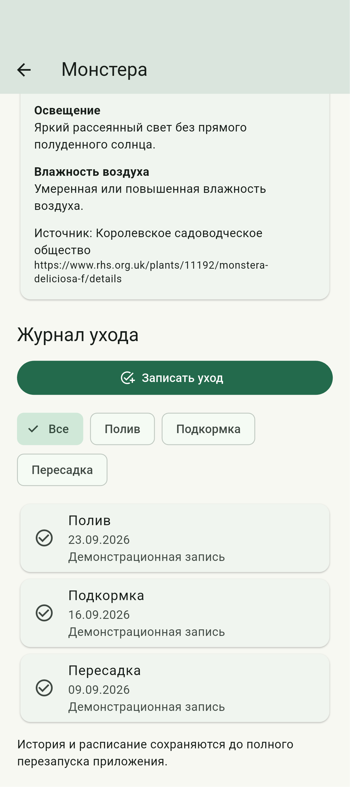
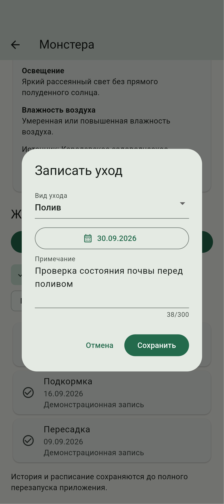
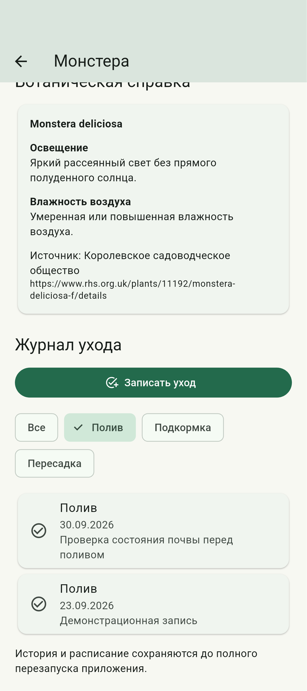
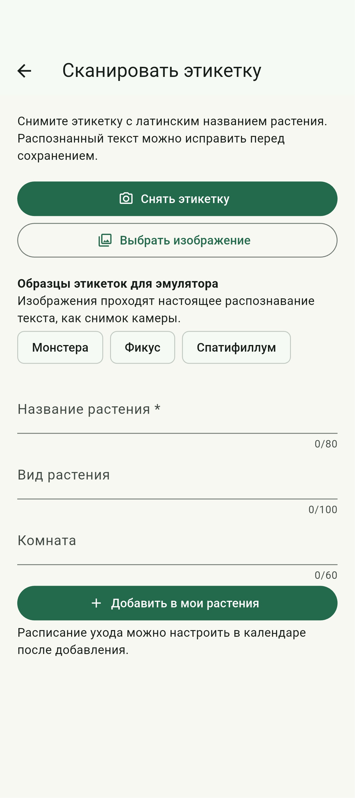
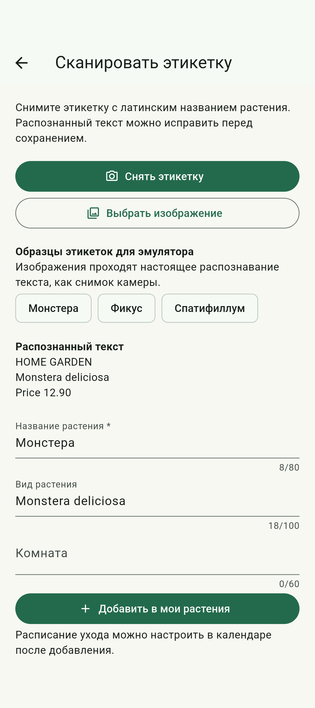

# Отчёт по лабораторной работе № 2

**Тема:** архитектурное проектирование мобильного приложения на основе шаблона Model–View–ViewModel.

Выполнил: студент группы ИТИ-41 Заяц М. С. Принял: старший преподаватель Семенченя Т. С. Вариант 7 – мобильный органайзер домашних растений.

**Цель работы:** изучить разделение данных, логики приложения и пользовательского интерфейса, реализовать детальный экран растения, журнал выполненного ухода и распознавание текстового названия с этикетки средствами Flutter.

**Задание:** реализовать часть варианта, выделенную лиловым цветом в исходном документе. Приложение должно отображать историю поливов, подкормок и пересадок, предоставлять справку об освещении и влажности, а также распознавать текстовое название растения с этикетки или ценника. Дополнительно требуется повторение назначенных процедур с интервалом в семь календарных дней.

Исходный код размещён в открытом репозитории: https://github.com/Jewilor/home-plants-organizer. В работе использованы язык Dart и программная платформа Flutter. Основной платформой демонстрации является Android. Данные текущего этапа хранятся в оперативной памяти. Реляционное хранилище, обращение к сетевой энциклопедии и локальные уведомления относятся к последующим лабораторным работам.

**Ход выполнения работы:** в форму назначения процедуры добавлена кнопка «Еженедельно». Состояние кнопки сохраняется вместе с датой начала, видом ухода и идентификатором растения. Для каждого выбранного дня проверяется, совпадает ли он с датой начала или с соответствующим днём недели после начала серии. Благодаря этому повторения отображаются в следующих месяцах и годах без создания бесконечного списка записей. Внешний вид формы с включённым повторением представлен на рисунке 1.


После сохранения серии в календаре выбран день следующей недели. Для этого дня отображается та же процедура с отметкой «Еженедельно». Выполнение отдельного полива не завершает будущие повторения: состояние выполнения хранится для каждой даты отдельно. Редактирование и удаление повторяющейся процедуры применяются ко всей серии, что поясняется в интерфейсе. Результат отображения следующего повторения представлен на рисунке 2.


Для просмотра дополнительных сведений создан отдельный экран растения. Переход на него выполняется через действие «Справка и журнал ухода» на карточке каталога. На экране отображаются название, ботаническое имя и помещение. Ботаническая справка загружается из включённого в приложение файла JSON, сопоставляется с видом растения и содержит сведения об освещении и влажности. Переименование пользовательского названия не изменяет ботанический вид. При отсутствии известного вида выводится сообщение об отсутствии сведений. Результат реализации справки для монстеры представлен на рисунке 3.


Для журнала создана самостоятельная модель фактически выполненной процедуры. Она содержит идентификатор растения, вид ухода, дату выполнения и примечание. История сортируется от более поздних записей к ранним. Данные журнала отделены от будущего расписания, поэтому удаление назначенной процедуры не удаляет сведения о ранее выполненном уходе. Начальные записи для демонстрации явно обозначены в интерфейсе. Результат просмотра истории поливов, подкормок и пересадок представлен на рисунке 4.



Для пополнения истории реализована форма «Записать уход». В форме выбираются вид процедуры и дата фактического выполнения, а также вводится примечание. Будущая дата недоступна для записи выполненного действия. Перед сохранением проверяется отсутствие одинакового вида ухода для этого растения за выбранный день. Сохранение полива закрывает соответствующие просроченные и сегодняшние назначения, сохраняя будущие даты. Результат ввода записи представлен на рисунке 5.



В журнал добавлен выбор вида процедуры. При выборе «Полив» отображаются только записи полива, а при выборе «Все» восстанавливается полный журнал. После сохранения новой записи изменения видны без повторного открытия экрана, поскольку модель представления уведомляет подписанное представление. Результат фильтрации с новой записью представлен на рисунке 6.



Для автоматизированного добавления создан экран распознавания этикетки. Пользователь может получить изображение через системную камеру, выбрать его из галереи либо использовать встроенный образец при работе в эмуляторе. Встроенные изображения содержат текстовые названия монстеры, фикуса и спатифиллума и проходят тот же распознаватель, что и снимок камеры. Набор источников изображения представлен на рисунке 7.



Распознавание выполняется на устройстве с помощью Google ML Kit. В текущей реализации используется распознавание латинского письма, поэтому для съёмки требуется этикетка с латинским ботаническим названием. Из полученных строк выделяется название растения, а цена и служебный текст исключаются. Пользователь видит исходный распознанный текст и может исправить название и вид перед добавлением в каталог. Распознанный вид связывается с локальной справкой при наличии соответствующей записи. Результат обработки изображения монстеры представлен на рисунке 8.



**Описание реализации:** модели Plant, CareProcedure, CareRecord и BotanicalProfile содержат данные предметной области. Класс GardenViewModel управляет каталогом, расписанием и историей. Класс PlantDetailViewModel подготавливает справку и отфильтрованный журнал, а LabelScanViewModel управляет состоянием распознавания, результатом и сообщениями об ошибках. Представления подписаны на изменения через ListenableBuilder. Источник справки и служба распознавания передаются через конструкторы, поэтому при автоматических проверках их можно заменить контролируемыми реализациями. Такое разделение уменьшает зависимость интерфейса от способа получения данных.

Ниже приведён фрагмент модели недельной процедуры. Дата начала ограничивает период повторений, а совпадение дня недели задаёт интервал в семь календарных дней.

```dart
bool occursOn(DateTime day) {
  final start = dateOnly(date);
  final target = dateOnly(day);
  return sameDay(start, target) ||
      (weekly && !target.isBefore(start) && start.weekday == target.weekday);
}
```

Загрузка локального справочника осуществляется через службу AssetBotanicalRepository. Содержимое файла преобразуется в модели BotanicalProfile. Это пример чтения структурированных данных текущего этапа; постоянная база данных пока не используется.

```dart
return (jsonDecode(text) as List)
    .map((item) => BotanicalProfile.fromJson(item as Map<String, dynamic>))
    .toList();
```

Представление получает обновления состояния через ListenableBuilder. При изменении фильтра или сохранении записи вызывается notifyListeners, после чего перестраивается соответствующая часть детального экрана. Ниже приведён элемент интерфейса для выбора полного журнала. Обработчик передаёт действие модели представления, не изменяя список записей непосредственно в интерфейсе.

```dart
ChoiceChip(
  label: const Text('Все'),
  selected: model.filter == null,
  onSelected: (_) => model.selectFilter(null),
),
```

Следующий фрагмент класса PlantDetailViewModel показывает подготовку истории для представления. Записи выбираются по идентификатору растения и виду ухода, а затем сортируются по дате. Изменение фильтра уведомляет подписанное представление. Таким образом, правило выборки находится в модели представления, а построение элементов экрана выполняется в представлении.

```dart
List<CareRecord> get history =>
    garden.records
        .where(
          (r) => r.plantId == plantId &&
              (filter == null || r.type == filter),
        )
        .toList()
      ..sort((a, b) => b.performedOn.compareTo(a.performedOn));

void selectFilter(CareType? value) {
  filter = value;
  _changed();
}

void _changed() {
  if (!_disposed) notifyListeners();
}
```

Обработка изображения выполняется асинхронно. Во время распознавания действия временно недоступны, а интерфейс показывает индикатор выполнения. Полученный текст передаётся модели представления для выделения и подтверждения названия.

```dart
final result = await _recognizer.processImage(
  InputImage.fromFilePath(path),
);
return result.text;
```

**Результаты проверки:** статический анализ завершился без замечаний. Двадцать автоматических тестов проверяют календарные границы, недельные повторения, операции с растениями и процедурами, историю ухода, отмену полива, поиск ботанической справки и выделение названия из распознанного текста. Дополнительный сценарий в эмуляторе Android проверяет настоящее распознавание трёх встроенных изображений, создание серии, просмотр следующего повторения, ввод и фильтрацию записи журнала, а также добавление распознанного растения. Снимки получены из работающего приложения. Сценарий съёмки физической этикетки на реальном телефоне не проверялся; для демонстрации использованы встроенные изображения.

**Ответы на контрольные вопросы:** в исходном задании второй лабораторной приведены вопросы о хранении данных. Ниже рассматриваются их принципы; использование перечисленных баз данных в текущем этапе не утверждается.

Лёгкое хранилище настроек, соответствующее назначению UserDefaults, используется для небольших значений, таких как логические признаки, строки и числовые настройки. Оно не заменяет базу данных для связанных растений, процедур и истории. Объёмные данные и частые изменения большого числа записей следует обрабатывать отдельным хранилищем.

Сериализация преобразует объект в представление, пригодное для хранения или передачи, а десериализация восстанавливает объект. Назначению Codable и Decodable в языке Dart соответствуют методы преобразования, например fromJson и toJson. Если название поля отличается от имени свойства, нужный ключ указывается явно при чтении словаря.

SQLite представляет данные в связанных таблицах и использует язык запросов SQL. Realm использует объектный подход с моделями и связями между объектами. Выбор между ними зависит от структуры данных, требований к запросам, поддерживаемых средств разработки и способа обновления схемы.

В SwiftData компонент ModelContainer определяет набор моделей и конфигурацию хранилища, а ModelContext обеспечивает операции с объектами и сохранение изменений. В адаптации для Flutter аналогичные обязанности разделяются между подключением к базе данных и службой доступа к данным. В текущем проекте обязанности источника данных выполняет состояние в оперативной памяти.

Связь одного растения с несколькими процедурами выражается идентификатором растения в каждой процедуре. В реляционной базе такая связь обычно обеспечивается внешним ключом. Каскадное удаление удаляет зависимые записи вместе с основной. В текущем проекте удаление растения явно удаляет его расписание и историю в GardenViewModel.

Миграция схемы требуется при изменении структуры сохранённых данных, например добавлении обязательного поля или изменении связи. При обновлении приложения преобразование существующих записей должно сохранить пользовательские сведения. Для текущего этапа миграция не требуется, поскольку постоянное хранилище ещё не создано.

Обёртка Query в SwiftUI связывает выборку хранилища с представлением. Во Flutter аналогичная задача решается запросом службы данных и подпиской представления на обновления. В проекте фильтрация истории выполняется в PlantDetailViewModel, а обновление виджетов происходит через ChangeNotifier.

Потокобезопасность предполагает согласованный доступ к данным и соблюдение ограничений используемого хранилища. Для длительных операций требуется асинхронная обработка и безопасная передача результата в состояние интерфейса. В проекте чтение справки и распознавание выполняются асинхронно; после закрытия экрана модель представления прекращает уведомлять представление.

Ленивая загрузка получает данные при обращении к ним, уменьшая объём одновременно загруженной информации. В проекте недельная серия вычисляет экземпляры только для запрошенного дня, а справочник читается при открытии соответствующего экрана. Это не является реализацией ленивой загрузки базы данных, но использует сходный принцип подготовки сведений по запросу.

Для защиты постоянного хранилища могут применяться шифрование базы данных и защищённое хранение ключа средствами платформы. Ключ нельзя хранить открыто рядом с зашифрованным файлом. В текущей лабораторной шифрование базы данных не реализуется.

Вывод: выполнена функциональная часть второй лабораторной работы для варианта 7. Созданы журнал поливов, подкормок и пересадок, ботаническая справка и распознавание текстового названия с этикетки. Дополнительно реализовано еженедельное повторение назначенных процедур. Модели, состояние приложения и интерфейс разделены в соответствии с архитектурой Model–View–ViewModel. Полученная структура подготовлена для добавления постоянного хранения на следующем этапе.

**Приложение А**

**(обязательное)**

**Листинг программы**

В приложении приведены полные тексты файлов, созданных или изменённых при выполнении второй лабораторной работы. Включены также настройки зависимостей, данные справочника и программы автоматической проверки. В изменённых файлах сохранены необходимые части кода первой лабораторной работы, которые используются при работе приложения.

**«pubspec.yaml»**

```yaml
name: home_plants_organizer
description: Мобильный органайзер домашних растений с календарём ухода.
publish_to: none
version: 1.1.0+2
environment:
  sdk: '>=3.8.0 <4.0.0'
dependencies:
  flutter:
    sdk: flutter
  flutter_localizations:
    sdk: flutter
  image_picker: ^1.2.3
  google_mlkit_text_recognition: ^0.17.1
  path_provider: ^2.1.5

dev_dependencies:
  integration_test:
    sdk: flutter
  flutter_test:
    sdk: flutter
  flutter_lints: ^6.0.0
flutter:
  uses-material-design: true
  assets:
    - assets/botanical_profiles.json
    - assets/labels/
```

**«assets/botanical_profiles.json»**

```json
[
  {
    "name": "Монстера",
    "species": "Monstera deliciosa",
    "aliases": [
      "Монстера",
      "Monstera deliciosa"
    ],
    "light": "Яркий рассеянный свет без прямого полуденного солнца.",
    "humidity": "Умеренная или повышенная влажность воздуха.",
    "source": "https://www.rhs.org.uk/plants/11192/monstera-deliciosa-f/details"
  },
  {
    "name": "Фикус",
    "species": "Ficus elastica",
    "aliases": [
      "Фикус",
      "Ficus elastica"
    ],
    "light": "Яркий рассеянный или фильтрованный свет.",
    "humidity": "Умеренная влажность воздуха; избегать чрезмерно сухого воздуха.",
    "source": "https://www.rhs.org.uk/plants/ornamental-figs/growing-guide/"
  },
  {
    "name": "Спатифиллум",
    "species": "Spathiphyllum wallisii",
    "aliases": [
      "Спатифиллум",
      "Spathiphyllum wallisii"
    ],
    "light": "Непрямой свет; защищать листья от прямого солнца.",
    "humidity": "Умеренная влажность воздуха, постоянное тепло.",
    "source": "https://www.rhs.org.uk/plants/peace-lilies"
  },
  {
    "name": "Сансевиерия",
    "species": "Dracaena trifasciata",
    "aliases": [
      "Сансевиерия",
      "Dracaena trifasciata",
      "Sansevieria trifasciata"
    ],
    "light": "Предпочитает яркое место; переносит лёгкую тень.",
    "humidity": "Низкая влажность воздуха; дополнительное опрыскивание не требуется.",
    "source": "https://www.rhs.org.uk/plants/sansevieria/growing-guide"
  }
]
```

**«lib/models/plant.dart»**

```dart
/// Возвращает дату без времени для календарного сравнения.
DateTime dateOnly(DateTime date) => DateTime(date.year, date.month, date.day);

/// Прибавляет указанное количество календарных дней.
DateTime addDays(DateTime date, int days) =>
    DateTime(date.year, date.month, date.day + days);

/// Проверяет совпадение двух дат без учёта времени.
bool sameDay(DateTime a, DateTime b) => dateOnly(a) == dateOnly(b);

/// Состояние полива растения, используемое для оформления карточки.
enum WateringStatus { overdue, today, upcoming, watered, unscheduled }

/// Вид процедуры ухода за комнатным растением.
enum CareType { watering, feeding, repotting }

/// Предоставляет русское название для вида процедуры.
extension CareTypeLabel on CareType {
  String get label => switch (this) {
    CareType.watering => 'Полив',
    CareType.feeding => 'Подкормка',
    CareType.repotting => 'Пересадка',
  };
}

/// Модель комнатного растения и вычисляемых сведений о поливе.
class Plant {
  const Plant({
    required this.id,
    required this.name,
    required this.species,
    required this.room,
    this.nextWatering,
    this.lastWateredOn,
    required this.art,
  });
  final String id;
  final String name;
  final String species;
  final String room;
  // These dates are derived by the ViewModel from the procedures.
  final DateTime? nextWatering;
  final DateTime? lastWateredOn;
  final int art;

  /// Возвращает состояние полива относительно указанной даты.
  WateringStatus statusAt(DateTime now) {
    if (lastWateredOn != null && sameDay(lastWateredOn!, now)) {
      return WateringStatus.watered;
    }
    if (nextWatering == null) return WateringStatus.unscheduled;
    final due = dateOnly(nextWatering!);
    final today = dateOnly(now);
    if (due.isBefore(today)) return WateringStatus.overdue;
    if (due == today) return WateringStatus.today;
    return WateringStatus.upcoming;
  }
}

/// Модель одной процедуры ухода, связанной с растением по идентификатору.
class CareProcedure {
  const CareProcedure({
    this.id = '',
    required this.plantId,
    required this.date,
    required this.type,
    this.completedOn,
    this.weekly = false,
  });
  final String id;
  final String plantId;
  final DateTime date;
  final CareType type;
  final DateTime? completedOn;

  /// Повторять процедуру каждые семь календарных дней от даты начала.
  final bool weekly;

  /// Проверяет, относится ли день к однократной процедуре или недельной серии.
  bool occursOn(DateTime day) {
    final start = dateOnly(date);
    final target = dateOnly(day);
    return sameDay(start, target) ||
        (weekly && !target.isBefore(start) && start.weekday == target.weekday);
  }

  /// Создаёт отображаемый экземпляр серии для конкретной даты.
  CareProcedure occurrence(DateTime day, DateTime? completion) => CareProcedure(
    id: id,
    plantId: plantId,
    date: dateOnly(day),
    type: type,
    weekly: weekly,
    completedOn: completion,
  );

  /// Показывает, была ли процедура отмечена выполненной.
  bool get isCompleted => completedOn != null;

  /// Создаёт копию процедуры с новой отметкой выполнения.
  CareProcedure withCompletion(DateTime? value) => CareProcedure(
    id: id,
    plantId: plantId,
    date: date,
    type: type,
    completedOn: value,
    weekly: weekly,
  );
}
```

**«lib/models/care_record.dart»**

```dart
import 'plant.dart';

/// Фактически выполненная процедура. История не зависит от будущего расписания.
class CareRecord {
  const CareRecord({
    required this.id,
    required this.plantId,
    required this.type,
    required this.performedOn,
    this.note = '',
  });
  final String id;
  final String plantId;
  final CareType type;
  final DateTime performedOn;
  final String note;
}
```

**«lib/models/botanical_profile.dart»**

```dart
/// Сведения об условиях содержания известного вида растения.
class BotanicalProfile {
  const BotanicalProfile({
    required this.name,
    required this.species,
    required this.aliases,
    required this.light,
    required this.humidity,
    required this.source,
  });
  final String name, species, light, humidity, source;
  final List<String> aliases;

  /// Преобразует запись локального справочника в модель предметной области.
  factory BotanicalProfile.fromJson(Map<String, dynamic> json) =>
      BotanicalProfile(
        name: json['name'] as String,
        species: json['species'] as String,
        aliases: List<String>.from(json['aliases'] as List),
        light: json['light'] as String,
        humidity: json['humidity'] as String,
        source: json['source'] as String,
      );
}
```

**«lib/services/botanical_repository.dart»**

```dart
import 'dart:convert';
import 'package:flutter/services.dart';
import '../models/botanical_profile.dart';

/// Контракт локального справочника. Позволяет подменить источник в проверках.
abstract interface class BotanicalRepository {
  Future<List<BotanicalProfile>> load();
}

/// Загружает справочные сведения из включённого в приложение файла JSON.
class AssetBotanicalRepository implements BotanicalRepository {
  Future<List<BotanicalProfile>>? _cached;
  @override
  Future<List<BotanicalProfile>> load() => _cached ??= _read();
  Future<List<BotanicalProfile>> _read() async {
    late String text;
    try {
      text = await rootBundle.loadString('assets/botanical_profiles.json');
    } catch (_) {
      _cached = null;
      rethrow;
    }
    return (jsonDecode(text) as List)
        .map((item) => BotanicalProfile.fromJson(item as Map<String, dynamic>))
        .toList();
  }
}

/// Находит вид по точному названию или ботаническому имени, без угадывания ухода.
BotanicalProfile? profileFor(
  List<BotanicalProfile> profiles,
  String species,
  String name,
) {
  for (final query in [species, name]) {
    final normalized = query.trim().toLowerCase();
    if (normalized.isEmpty) continue;
    for (final profile in profiles) {
      if (profile.aliases.any((alias) => alias.toLowerCase() == normalized)) {
        return profile;
      }
    }
  }
  return null;
}
```

**«lib/services/label_recognition_service.dart»**

```dart
import 'dart:io';
import 'package:flutter/foundation.dart';
import 'package:flutter/services.dart';
import 'package:google_mlkit_text_recognition/google_mlkit_text_recognition.dart';
import 'package:image_picker/image_picker.dart';
import 'package:path_provider/path_provider.dart';

/// Источник изображения для распознавания названия: снимок, галерея или образец.
abstract interface class LabelRecognitionService {
  Future<String?> pickAndRecognize(ImageSource source);
  Future<String> recognizeSample(String asset);
  Future<String?> recoverLostImage();
  Future<void> close();
}

/// Выполняет настоящее распознавание латинского текста на устройстве Android.
/// Образцы этикеток проходят тот же распознаватель, что и снимок камеры.
class MlKitLabelRecognitionService implements LabelRecognitionService {
  final ImagePicker _picker = ImagePicker();
  final TextRecognizer _recognizer = TextRecognizer(
    script: TextRecognitionScript.latin,
  );
  bool get supported =>
      !kIsWeb && defaultTargetPlatform == TargetPlatform.android;
  void _checkPlatform() {
    if (!supported) {
      throw UnsupportedError('Распознавание доступно в Android-приложении.');
    }
  }

  Future<String> _recognize(String path) async {
    _checkPlatform();
    final result = await _recognizer.processImage(
      InputImage.fromFilePath(path),
    );
    if (result.text.trim().isEmpty) {
      throw FormatException('На изображении не найден текст.');
    }
    return result.text;
  }

  @override
  Future<String?> pickAndRecognize(ImageSource source) async {
    _checkPlatform();
    final image = await _picker.pickImage(
      source: source,
      maxWidth: 2000,
      imageQuality: 95,
    );
    return image == null ? null : _recognize(image.path);
  }

  @override
  Future<String> recognizeSample(String asset) async {
    _checkPlatform();
    final bytes = await rootBundle.load(asset);
    final dir = await getTemporaryDirectory();
    final file = File('${dir.path}/${asset.split('/').last}');
    await file.writeAsBytes(
      bytes.buffer.asUint8List(bytes.offsetInBytes, bytes.lengthInBytes),
    );
    return _recognize(file.path);
  }

  @override
  Future<String?> recoverLostImage() async {
    if (!supported) return null;
    final lost = await _picker.retrieveLostData();
    if (lost.exception != null) throw lost.exception!;
    return lost.files == null || lost.files!.isEmpty
        ? null
        : _recognize(lost.files!.first.path);
  }

  @override
  Future<void> close() async {
    if (supported) await _recognizer.close();
  }
}
```

**«lib/viewmodels/garden_view_model.dart»**

```dart
import 'package:flutter/foundation.dart';
import '../data/demo_garden.dart';
import '../models/plant.dart';
import '../models/care_record.dart';

/// Управляет растениями, расписанием и историей ухода в оперативной памяти.
/// Представления подписываются на изменения через [ChangeNotifier].
class GardenViewModel extends ChangeNotifier {
  GardenViewModel({DateTime Function()? clock, DemoGarden? garden})
    : _clock = clock ?? DateTime.now {
    today = dateOnly(_clock());
    selectedDate = today;
    visibleMonth = DateTime(today.year, today.month);
    final source = garden ?? DemoGarden(today);
    _plants = List.of(source.plants);
    _procedures = [
      for (var i = 0; i < source.procedures.length; i++)
        CareProcedure(
          id: 'seed-$i',
          plantId: source.procedures[i].plantId,
          date: source.procedures[i].date,
          type: source.procedures[i].type,
          completedOn: source.procedures[i].completedOn,
        ),
    ];
    if (_plants.isNotEmpty) {
      for (final type in CareType.values) {
        _records.add(
          CareRecord(
            id: 'history-${type.name}',
            plantId: _plants.first.id,
            type: type,
            performedOn: addDays(today, -7 * (type.index + 1)),
            note: 'Демонстрационная запись',
          ),
        );
      }
    }
  }
  final DateTime Function() _clock;
  late DateTime today;
  late DateTime selectedDate;
  late DateTime visibleMonth;
  late final List<Plant> _plants;
  late final List<CareProcedure> _procedures;
  final List<CareRecord> _records = [];
  // Отметки хранятся для отдельных дат серии, а не для всей серии сразу.
  final Map<String, Map<DateTime, DateTime>> _completions = {};
  int _sequence = 0;
  String _newId(String prefix) => '$prefix-${_sequence++}';

  /// Возвращает исходные однократные процедуры и начала недельных серий.
  List<CareProcedure> get procedures => List.unmodifiable(_procedures);

  /// Возвращает неизменяемую историю выполненных действий.
  List<CareRecord> get records => List.unmodifiable(_records);

  /// Возвращает исходную запись серии для редактирования всех повторений.
  CareProcedure procedureById(String id) =>
      _procedures.firstWhere((p) => p.id == id);

  DateTime? _completion(CareProcedure p, DateTime day) => p.weekly
      ? (_completions[p.id] ?? const <DateTime, DateTime>{})[dateOnly(day)]
      : p.completedOn;

  DateTime? _nextPending(CareProcedure p) {
    if (!p.weekly) return p.isCompleted ? null : p.date;
    var day = dateOnly(p.date);
    while (_completion(p, day) != null) {
      day = addDays(day, 7);
    }
    return day;
  }

  /// Срок ближайшего незавершённого полива вычисляется из расписания.
  List<Plant> get plants => List.unmodifiable(
    _plants.map((plant) {
      final pending =
          _procedures
              .where(
                (p) => p.plantId == plant.id && p.type == CareType.watering,
              )
              .map(_nextPending)
              .whereType<DateTime>()
              .toList()
            ..sort();
      final completed =
          _records
              .where(
                (r) => r.plantId == plant.id && r.type == CareType.watering,
              )
              .map((r) => r.performedOn)
              .toList()
            ..sort();
      return Plant(
        id: plant.id,
        name: plant.name,
        species: plant.species,
        room: plant.room,
        art: plant.art,
        nextWatering: pending.isEmpty ? null : pending.first,
        lastWateredOn: completed.isEmpty ? null : completed.last,
      );
    }),
  );

  /// Количество карточек с просроченным поливом относительно текущего дня.
  int get overdueCount =>
      plants.where((p) => p.statusAt(today) == WateringStatus.overdue).length;

  /// Вычисляет повторы только для запрошенного дня без генерации бесконечного списка.
  List<CareProcedure> proceduresOn(DateTime date) => [
    for (final p in _procedures)
      if (p.occursOn(date)) p.occurrence(date, _completion(p, date)),
  ];

  /// Находит актуальное растение, поэтому переименование видно и в календаре.
  Plant plantFor(CareProcedure procedure) =>
      plants.firstWhere((p) => p.id == procedure.plantId);

  /// Добавляет или изменяет растение и при необходимости планирует первый полив.
  String savePlant({
    String? id,
    required String name,
    String species = '',
    String room = '',
    DateTime? firstWatering,
    bool weekly = false,
  }) {
    final clean = name.trim();
    if (clean.isEmpty) throw ArgumentError('Введите название растения.');
    if (clean.length > 80 ||
        species.trim().length > 100 ||
        room.trim().length > 60) {
      throw ArgumentError('Сократите слишком длинное поле.');
    }
    final index = id == null ? -1 : _plants.indexWhere((p) => p.id == id);
    if (id != null && index < 0) throw ArgumentError('Растение уже удалено.');
    final plant = Plant(
      id: id ?? _newId('plant'),
      name: clean,
      species: species.trim(),
      room: room.trim(),
      art: index < 0 ? _sequence % 4 : _plants[index].art,
    );
    if (index < 0) {
      _plants.add(plant);
      if (firstWatering != null) {
        _procedures.add(
          CareProcedure(
            id: _newId('procedure'),
            plantId: plant.id,
            date: dateOnly(firstWatering),
            type: CareType.watering,
            weekly: weekly,
          ),
        );
      }
    } else {
      _plants[index] = plant;
    }
    notifyListeners();
    return plant.id;
  }

  /// Удаляет растение вместе с расписанием, отметками и историей ухода.
  void deletePlant(String id) {
    final ids = _procedures
        .where((p) => p.plantId == id)
        .map((p) => p.id)
        .toSet();
    _plants.removeWhere((p) => p.id == id);
    _procedures.removeWhere((p) => p.plantId == id);
    _completions.removeWhere((key, _) => ids.contains(key));
    _records.removeWhere((r) => r.plantId == id);
    notifyListeners();
  }

  bool _overlaps(CareProcedure a, CareProcedure b) {
    if (a.weekly && b.weekly) return a.date.weekday == b.date.weekday;
    if (a.weekly) return a.occursOn(b.date);
    if (b.weekly) return b.occursOn(a.date);
    return sameDay(a.date, b.date);
  }

  /// Сохраняет однократную процедуру или недельную серию.
  /// При редактировании серии меняются все её будущие даты; история сохраняется.
  String saveProcedure({
    String? id,
    required String plantId,
    required DateTime date,
    required CareType type,
    bool weekly = false,
  }) {
    if (!_plants.any((p) => p.id == plantId)) {
      throw ArgumentError('Выберите существующее растение.');
    }
    final index = id == null ? -1 : _procedures.indexWhere((p) => p.id == id);
    if (id != null && index < 0) throw ArgumentError('Процедура уже удалена.');
    final day = dateOnly(date);
    final old = index < 0 ? null : _procedures[index];
    final unchanged =
        old != null &&
        old.plantId == plantId &&
        old.type == type &&
        sameDay(old.date, day) &&
        old.weekly == weekly;
    final p = CareProcedure(
      id: id ?? _newId('procedure'),
      plantId: plantId,
      date: day,
      type: type,
      weekly: weekly,
      completedOn: unchanged ? old.completedOn : null,
    );
    if (_procedures.any(
      (other) =>
          other.id != id &&
          other.plantId == plantId &&
          other.type == type &&
          _overlaps(other, p),
    )) {
      throw ArgumentError(
        'Расписание пересекается с такой же процедурой этого растения.',
      );
    }
    if (!unchanged) _completions.remove(p.id);
    if (index < 0) {
      _procedures.add(p);
    } else {
      _procedures[index] = p;
    }
    selectedDate = day;
    visibleMonth = DateTime(day.year, day.month);
    notifyListeners();
    return p.id;
  }

  /// Удаляет процедуру или всю серию. Выполненные действия остаются в журнале.
  void deleteProcedure(String id) {
    _procedures.removeWhere((p) => p.id == id);
    _completions.remove(id);
    notifyListeners();
  }

  void _markDue(String plantId, CareType type, DateTime performedOn) {
    for (var i = 0; i < _procedures.length; i++) {
      final p = _procedures[i];
      if (p.plantId != plantId || p.type != type) continue;
      if (p.weekly) {
        final entries = _completions.putIfAbsent(p.id, () => {});
        for (
          var day = dateOnly(p.date);
          !day.isAfter(performedOn);
          day = addDays(day, 7)
        ) {
          entries.putIfAbsent(day, () => performedOn);
        }
      } else if (!p.isCompleted && !p.date.isAfter(performedOn)) {
        _procedures[i] = p.withCompletion(performedOn);
      }
    }
  }

  /// Записывает факт ухода. Будущую дату и повтор того же вида за день запрещает.
  void recordCare({
    required String plantId,
    required CareType type,
    required DateTime performedOn,
    String note = '',
  }) {
    refreshToday();
    final day = dateOnly(performedOn);
    if (!_plants.any((p) => p.id == plantId)) {
      throw ArgumentError('Растение уже удалено.');
    }
    if (day.isAfter(today)) {
      throw ArgumentError('Нельзя записать уход будущей датой.');
    }
    if (note.trim().length > 300) {
      throw ArgumentError('Сократите примечание до 300 символов.');
    }
    if (_records.any(
      (r) =>
          r.plantId == plantId && r.type == type && sameDay(r.performedOn, day),
    )) {
      throw ArgumentError('Такая запись ухода уже есть на выбранный день.');
    }
    _markDue(plantId, type, day);
    _records.add(
      CareRecord(
        id: _newId('record'),
        plantId: plantId,
        type: type,
        performedOn: day,
        note: note.trim(),
      ),
    );
    notifyListeners();
  }

  /// Отмечает полив за текущий день либо отменяет отметки этого дня.
  /// Недельная серия после выполнения сохраняет будущие повторения.
  void toggleWateredToday(String plantId) {
    refreshToday();
    final logged = _records.any(
      (r) =>
          r.plantId == plantId &&
          r.type == CareType.watering &&
          sameDay(r.performedOn, today),
    );
    if (!logged) {
      if (!_plants.any((p) => p.id == plantId)) return;
      recordCare(plantId: plantId, type: CareType.watering, performedOn: today);
      return;
    }
    _records.removeWhere(
      (r) =>
          r.plantId == plantId &&
          r.type == CareType.watering &&
          sameDay(r.performedOn, today),
    );
    for (var i = 0; i < _procedures.length; i++) {
      final p = _procedures[i];
      if (p.plantId != plantId || p.type != CareType.watering) continue;
      if (p.weekly) {
        _completions[p.id]?.removeWhere(
          (_, completed) => sameDay(completed, today),
        );
      } else if (p.completedOn != null && sameDay(p.completedOn!, today)) {
        _procedures[i] = p.withCompletion(null);
      }
    }
    notifyListeners();
  }

  /// Выбирает календарный день и соответствующий месяц.
  void selectDay(DateTime date) {
    selectedDate = dateOnly(date);
    visibleMonth = DateTime(date.year, date.month);
    notifyListeners();
  }

  /// Переключает календарь между месяцами, включая границу года.
  void changeMonth(int offset) {
    visibleMonth = DateTime(visibleMonth.year, visibleMonth.month + offset);
    selectedDate = visibleMonth;
    notifyListeners();
  }

  /// Возвращает календарь к текущему дню.
  void goToToday() {
    refreshToday();
    selectDay(today);
  }

  /// Обновляет дату при смене суток, сохраняя выбранный день календаря.
  void refreshToday() {
    final current = dateOnly(_clock());
    if (current != today) {
      today = current;
      notifyListeners();
    }
  }
}
```

**«lib/viewmodels/plant_detail_view_model.dart»**

```dart
import 'package:flutter/foundation.dart';
import '../models/plant.dart';
import '../models/care_record.dart';
import '../models/botanical_profile.dart';
import '../services/botanical_repository.dart';
import 'garden_view_model.dart';

/// Состояние детального экрана: справка, история и фильтр вида ухода.
class PlantDetailViewModel extends ChangeNotifier {
  PlantDetailViewModel({
    required this.garden,
    required this.plantId,
    required this.repository,
  }) {
    garden.addListener(_changed);
  }
  final GardenViewModel garden;
  final String plantId;
  final BotanicalRepository repository;
  List<BotanicalProfile> _profiles = [];
  bool loading = true;
  bool _disposed = false;
  String? error;
  CareType? filter;
  Plant? get plant {
    for (final p in garden.plants) {
      if (p.id == plantId) return p;
    }
    return null;
  }

  BotanicalProfile? get profile =>
      plant == null ? null : profileFor(_profiles, plant!.species, plant!.name);
  List<CareRecord> get history =>
      garden.records
          .where(
            (r) => r.plantId == plantId && (filter == null || r.type == filter),
          )
          .toList()
        ..sort((a, b) => b.performedOn.compareTo(a.performedOn));

  /// Асинхронно читает справочник, сохраняя состояние загрузки и ошибку.
  Future<void> load() async {
    loading = true;
    error = null;
    _changed();
    try {
      _profiles = await repository.load();
    } catch (_) {
      error = 'Не удалось загрузить ботаническую справку.';
    }
    if (!_disposed) {
      loading = false;
      notifyListeners();
    }
  }

  /// Выбирает вид ухода; значение null показывает полный журнал.
  void selectFilter(CareType? value) {
    filter = value;
    _changed();
  }

  void _changed() {
    if (!_disposed) notifyListeners();
  }

  @override
  void dispose() {
    _disposed = true;
    garden.removeListener(_changed);
    super.dispose();
  }
}
```

**«lib/viewmodels/label_scan_view_model.dart»**

```dart
import 'package:flutter/foundation.dart';
import 'package:flutter/services.dart';
import 'package:image_picker/image_picker.dart';
import '../models/botanical_profile.dart';
import '../services/botanical_repository.dart';
import '../services/label_recognition_service.dart';

/// Состояние распознавания этикетки. Полученное имя требует подтверждения пользователя.
class LabelScanViewModel extends ChangeNotifier {
  LabelScanViewModel({required this.service, required this.repository});
  final LabelRecognitionService service;
  final BotanicalRepository repository;
  bool busy = false;
  bool _disposed = false;
  String rawText = '';
  String suggestion = '';
  String? error;
  BotanicalProfile? profile;

  /// Исключает цену и служебные строки, отдавая приоритет известному виду.
  static String suggestName(String raw, List<BotanicalProfile> profiles) {
    final lower = raw.toLowerCase();
    for (final p in profiles) {
      if (lower.contains(p.species.toLowerCase())) return p.species;
    }
    final lines = raw
        .split('\n')
        .map((s) => s.trim())
        .where(
          (s) =>
              s.length >= 3 &&
              RegExp(r'[A-Za-zА-Яа-я]').hasMatch(s) &&
              !RegExp(
                r'\d|price|garden|plants|eur|usd',
                caseSensitive: false,
              ).hasMatch(s),
        )
        .toList();
    return lines.isEmpty ? '' : lines.first;
  }

  Future<void> _run(Future<String?> Function() operation) async {
    if (busy) return;
    busy = true;
    error = null;
    _emit();
    try {
      final raw = await operation();
      if (raw != null && !_disposed) {
        final profiles = await repository.load();
        if (_disposed) return;
        rawText = raw;
        suggestion = suggestName(raw, profiles);
        profile = profileFor(profiles, suggestion, suggestion);
        if (suggestion.isEmpty) {
          error =
              'Название не выделено. Введите его вручную или повторите снимок.';
        }
      }
    } on UnsupportedError {
      error = 'Распознавание доступно в Android-приложении.';
    } on FormatException {
      error = 'На изображении не найден текст. Сделайте более чёткий снимок.';
    } on PlatformException {
      error =
          'Не удалось открыть изображение или камеру. Проверьте разрешение и повторите.';
    } catch (_) {
      error = 'Не удалось распознать этикетку. Повторите попытку.';
    } finally {
      if (!_disposed) {
        busy = false;
        _emit();
      }
    }
  }

  Future<void> scanCamera() =>
      _run(() => service.pickAndRecognize(ImageSource.camera));
  Future<void> scanGallery() =>
      _run(() => service.pickAndRecognize(ImageSource.gallery));
  Future<void> scanSample(String asset) =>
      _run(() => service.recognizeSample(asset));
  Future<void> recover() => _run(service.recoverLostImage);
  void _emit() {
    if (!_disposed) notifyListeners();
  }

  @override
  void dispose() {
    _disposed = true;
    service.close();
    super.dispose();
  }
}
```

**«lib/views/editors.dart»**

```dart
import 'package:flutter/material.dart';
import '../models/plant.dart';
import '../viewmodels/garden_view_model.dart';

/// Форматирует дату для отображения в русскоязычном интерфейсе.
String fullDate(DateTime date) =>
    '${date.day.toString().padLeft(2, '0')}.${date.month.toString().padLeft(2, '0')}.${date.year}';

/// Кнопка выбора даты с открытием стандартного календаря Flutter.
class DateField extends StatelessWidget {
  const DateField({
    super.key,
    required this.date,
    required this.onChanged,
    this.lastDate,
  });
  final DateTime date;
  final DateTime? lastDate;
  final ValueChanged<DateTime> onChanged;
  @override
  Widget build(BuildContext context) => OutlinedButton.icon(
    key: const ValueKey('choose-date'),
    icon: const Icon(Icons.calendar_month_outlined),
    label: Text(fullDate(date)),
    onPressed: () async {
      final picked = await showDatePicker(
        context: context,
        initialDate: date,
        firstDate: DateTime(1900),
        lastDate: lastDate ?? DateTime(2200, 12, 31),
      );
      if (picked != null && context.mounted) onChanged(picked);
    },
  );
}

/// Диалог добавления или редактирования растения.
class PlantEditor extends StatefulWidget {
  const PlantEditor({super.key, required this.model, this.plant});
  final GardenViewModel model;
  final Plant? plant;
  @override
  State<PlantEditor> createState() => _PlantEditorState();
}

class _PlantEditorState extends State<PlantEditor> {
  final form = GlobalKey<FormState>();
  late final TextEditingController name;
  late final TextEditingController species;
  late final TextEditingController room;
  late DateTime date;
  bool schedule = true;
  bool weekly = false;
  String? error;
  @override
  void initState() {
    super.initState();
    name = TextEditingController(text: widget.plant?.name ?? '');
    species = TextEditingController(text: widget.plant?.species ?? '');
    room = TextEditingController(text: widget.plant?.room ?? '');
    date = widget.model.today;
  }

  @override
  void dispose() {
    name.dispose();
    species.dispose();
    room.dispose();
    super.dispose();
  }

  void save() {
    if (!form.currentState!.validate()) return;
    try {
      widget.model.savePlant(
        id: widget.plant?.id,
        name: name.text,
        species: species.text,
        room: room.text,
        firstWatering: widget.plant == null && schedule ? date : null,
        weekly: weekly,
      );
      Navigator.pop(context);
    } on ArgumentError catch (e) {
      setState(() => error = e.message.toString());
    }
  }

  @override
  Widget build(BuildContext context) => AlertDialog(
    insetPadding: const EdgeInsets.symmetric(horizontal: 16, vertical: 24),
    title: Text(
      widget.plant == null ? 'Новое растение' : 'Редактировать растение',
    ),
    content: SizedBox(
      width: 420,
      child: SingleChildScrollView(
        child: Form(
          key: form,
          child: Column(
            mainAxisSize: MainAxisSize.min,
            crossAxisAlignment: CrossAxisAlignment.stretch,
            children: [
              TextFormField(
                key: const ValueKey('plant-name'),
                controller: name,
                maxLength: 80,
                decoration: const InputDecoration(labelText: 'Название *'),
                textCapitalization: TextCapitalization.sentences,
                validator: (value) => value == null || value.trim().isEmpty
                    ? 'Введите название'
                    : null,
              ),
              TextFormField(
                key: const ValueKey('plant-species'),
                controller: species,
                maxLength: 100,
                decoration: const InputDecoration(labelText: 'Вид растения'),
              ),
              TextFormField(
                key: const ValueKey('plant-room'),
                controller: room,
                maxLength: 60,
                decoration: const InputDecoration(labelText: 'Комната'),
              ),
              if (widget.plant == null) ...[
                CheckboxListTile(
                  contentPadding: EdgeInsets.zero,
                  value: schedule,
                  title: const Text('Запланировать первый полив'),
                  onChanged: (value) => setState(() => schedule = value!),
                ),
                if (schedule)
                  WeeklyChoice(
                    value: weekly,
                    onChanged: (v) => setState(() => weekly = v),
                  ),
                if (schedule)
                  DateField(
                    date: date,
                    onChanged: (value) => setState(() => date = value),
                  ),
              ] else
                const Text(
                  'Даты и процедуры ухода можно изменить в календаре.',
                ),
              if (error != null)
                Text(
                  error!,
                  style: TextStyle(color: Theme.of(context).colorScheme.error),
                ),
            ],
          ),
        ),
      ),
    ),
    actions: [
      TextButton(
        onPressed: () => Navigator.pop(context),
        child: const Text('Отмена'),
      ),
      FilledButton(
        key: const ValueKey('save-plant'),
        onPressed: save,
        child: const Text('Сохранить'),
      ),
    ],
  );
}

/// Диалог добавления или редактирования процедуры ухода.
class ProcedureEditor extends StatefulWidget {
  const ProcedureEditor({super.key, required this.model, this.procedure});
  final GardenViewModel model;
  final CareProcedure? procedure;
  @override
  State<ProcedureEditor> createState() => _ProcedureEditorState();
}

class _ProcedureEditorState extends State<ProcedureEditor> {
  late String plantId;
  late CareType type;
  late DateTime date;
  bool weekly = false;
  String? error;
  @override
  void initState() {
    super.initState();
    plantId = widget.procedure?.plantId ?? widget.model.plants.first.id;
    type = widget.procedure?.type ?? CareType.watering;
    date = widget.procedure?.date ?? widget.model.selectedDate;
    weekly = widget.procedure?.weekly ?? false;
  }

  void save() {
    try {
      widget.model.saveProcedure(
        id: widget.procedure?.id,
        plantId: plantId,
        type: type,
        date: date,
        weekly: weekly,
      );
      Navigator.pop(context);
    } on ArgumentError catch (e) {
      setState(() => error = e.message.toString());
    }
  }

  @override
  Widget build(BuildContext context) => AlertDialog(
    insetPadding: const EdgeInsets.symmetric(horizontal: 16, vertical: 24),
    title: Text(
      widget.procedure == null ? 'Новая процедура' : 'Редактировать процедуру',
    ),
    content: SizedBox(
      width: 420,
      child: SingleChildScrollView(
        child: Column(
          mainAxisSize: MainAxisSize.min,
          crossAxisAlignment: CrossAxisAlignment.stretch,
          children: [
            DropdownButtonFormField<String>(
              key: const ValueKey('procedure-plant'),
              initialValue: plantId,
              isExpanded: true,
              decoration: const InputDecoration(labelText: 'Растение'),
              items: [
                for (final plant in widget.model.plants)
                  DropdownMenuItem(
                    value: plant.id,
                    child: Text(
                      plant.room.isEmpty
                          ? plant.name
                          : '${plant.name} · ${plant.room}',
                      maxLines: 1,
                      overflow: TextOverflow.ellipsis,
                    ),
                  ),
              ],
              onChanged: (value) => setState(() => plantId = value!),
            ),
            const SizedBox(height: 16),
            DropdownButtonFormField<CareType>(
              key: const ValueKey('procedure-type'),
              initialValue: type,
              isExpanded: true,
              decoration: const InputDecoration(labelText: 'Процедура'),
              items: [
                for (final value in CareType.values)
                  DropdownMenuItem(value: value, child: Text(value.label)),
              ],
              onChanged: (value) => setState(() => type = value!),
            ),
            const SizedBox(height: 20),
            const Text('Дата процедуры'),
            DateField(
              date: date,
              onChanged: (value) => setState(() => date = value),
            ),
            const SizedBox(height: 12),
            WeeklyChoice(
              value: weekly,
              onChanged: (v) => setState(() => weekly = v),
            ),
            if (widget.procedure?.weekly ?? false)
              const Text('Изменения применяются ко всей серии повторений.'),
            if (widget.procedure?.isCompleted ?? false)
              const Padding(
                padding: EdgeInsets.only(top: 12),
                child: Text(
                  'При смене даты, растения или вида процедуры отметка выполнения будет снята.',
                ),
              ),
            if (error != null)
              Padding(
                padding: const EdgeInsets.only(top: 12),
                child: Text(
                  error!,
                  style: TextStyle(color: Theme.of(context).colorScheme.error),
                ),
              ),
          ],
        ),
      ),
    ),
    actions: [
      TextButton(
        onPressed: () => Navigator.pop(context),
        child: const Text('Отмена'),
      ),
      FilledButton(
        key: const ValueKey('save-procedure'),
        onPressed: save,
        child: const Text('Сохранить'),
      ),
    ],
  );
}

/// Переключатель повторения процедуры с интервалом семь календарных дней.
class WeeklyChoice extends StatelessWidget {
  const WeeklyChoice({super.key, required this.value, required this.onChanged});
  final bool value;
  final ValueChanged<bool> onChanged;
  @override
  Widget build(BuildContext context) => Column(
    crossAxisAlignment: CrossAxisAlignment.start,
    children: [
      FilterChip(
        key: const ValueKey('weekly-choice'),
        label: const Text('Еженедельно'),
        avatar: const Icon(Icons.repeat, size: 18),
        selected: value,
        onSelected: onChanged,
      ),
      Text(
        value
            ? 'Повторять каждые 7 дней с выбранной даты'
            : 'Процедура на одну дату',
        style: Theme.of(context).textTheme.bodySmall,
      ),
    ],
  );
}
```

**«lib/views/garden_screen.dart»**

```dart
import 'dart:async';
import 'package:flutter/material.dart';
import '../models/plant.dart';
import '../viewmodels/garden_view_model.dart';
import 'editors.dart';
import 'plant_detail_screen.dart';
import 'label_scan_screen.dart';

const forest = Color(0xFF285B43);
const ink = Color(0xFF20392D);
const muted = Color(0xFF69776C);
const months = [
  'Январь',
  'Февраль',
  'Март',
  'Апрель',
  'Май',
  'Июнь',
  'Июль',
  'Август',
  'Сентябрь',
  'Октябрь',
  'Ноябрь',
  'Декабрь',
];

/// Форматирует дату для краткого отображения в заголовке.
String shortDate(DateTime date) =>
    '${date.day.toString().padLeft(2, '0')}.${date.month.toString().padLeft(2, '0')}';
const heading = TextStyle(
  fontSize: 26,
  fontWeight: FontWeight.w800,
  color: ink,
);

/// Главный экран каталога растений и календаря процедур.
class GardenScreen extends StatefulWidget {
  const GardenScreen({super.key, this.viewModel});
  final GardenViewModel? viewModel;
  @override
  State<GardenScreen> createState() => _GardenScreenState();
}

class _GardenScreenState extends State<GardenScreen>
    with WidgetsBindingObserver {
  late final GardenViewModel model;
  late final Timer timer;
  int tab = 0;
  @override
  void initState() {
    super.initState();
    model = widget.viewModel ?? GardenViewModel();
    WidgetsBinding.instance.addObserver(this);
    timer = Timer.periodic(
      const Duration(seconds: 30),
      (_) => model.refreshToday(),
    );
  }

  @override
  void didChangeAppLifecycleState(AppLifecycleState state) {
    if (state == AppLifecycleState.resumed) model.refreshToday();
  }

  @override
  void dispose() {
    timer.cancel();
    WidgetsBinding.instance.removeObserver(this);
    if (widget.viewModel == null) model.dispose();
    super.dispose();
  }

  /// Открывает форму создания или изменения растения.
  void editPlant([Plant? plant]) {
    showDialog<void>(
      context: context,
      builder: (_) => PlantEditor(model: model, plant: plant),
    );
  }

  /// Открывает форму создания или изменения процедуры.
  void editProcedure([CareProcedure? procedure]) {
    if (model.plants.isEmpty) return;
    showDialog<void>(
      context: context,
      builder: (_) => ProcedureEditor(
        model: model,
        procedure: procedure == null ? null : model.procedureById(procedure.id),
      ),
    );
  }

  /// Показывает подтверждение перед удалением записи.
  Future<void> confirmDelete(
    String title,
    String description,
    VoidCallback remove,
  ) async {
    final confirmed = await showDialog<bool>(
      context: context,
      builder: (context) => AlertDialog(
        title: Text(title),
        content: Text(description),
        actions: [
          TextButton(
            onPressed: () => Navigator.pop(context, false),
            child: const Text('Отмена'),
          ),
          FilledButton(
            key: const ValueKey('confirm-delete'),
            onPressed: () => Navigator.pop(context, true),
            child: const Text('Удалить'),
          ),
        ],
      ),
    );
    if (confirmed == true && mounted) remove();
  }

  @override
  Widget build(BuildContext context) => ListenableBuilder(
    listenable: model,
    builder: (context, _) => Scaffold(
      appBar: AppBar(
        backgroundColor: const Color(0xFFF7F8F2),
        title: const Row(
          children: [
            Icon(Icons.spa_outlined, color: forest),
            SizedBox(width: 10),
            Flexible(
              child: Text(
                'Листва',
                maxLines: 1,
                overflow: TextOverflow.ellipsis,
                style: TextStyle(fontWeight: FontWeight.w800, color: ink),
              ),
            ),
          ],
        ),
        actions: [
          Padding(
            padding: const EdgeInsets.only(right: 16),
            child: Text(
              shortDate(model.today),
              style: const TextStyle(color: muted),
            ),
          ),
        ],
      ),
      bottomNavigationBar: NavigationBar(
        selectedIndex: tab,
        onDestinationSelected: (value) => setState(() => tab = value),
        destinations: const [
          NavigationDestination(
            icon: Icon(Icons.yard_outlined),
            label: 'Мой сад',
          ),
          NavigationDestination(
            icon: Icon(Icons.calendar_month_outlined),
            label: 'Календарь',
          ),
        ],
      ),
      body: SafeArea(
        child: Align(
          alignment: Alignment.topCenter,
          child: ConstrainedBox(
            constraints: const BoxConstraints(maxWidth: 1100),
            child: LayoutBuilder(
              builder: (context, constraints) => SingleChildScrollView(
                key: ValueKey('page-$tab'),
                // Ограниченная прокрутка убирает эффект растягивания на Android.
                physics: const ClampingScrollPhysics(),
                padding: const EdgeInsets.fromLTRB(20, 12, 20, 24),
                child: constraints.maxWidth >= 850
                    ? Row(
                        crossAxisAlignment: CrossAxisAlignment.start,
                        children: [
                          Expanded(child: garden()),
                          const SizedBox(width: 28),
                          Expanded(child: calendar()),
                        ],
                      )
                    : tab == 0
                    ? garden()
                    : calendar(),
              ),
            ),
          ),
        ),
      ),
    ),
  );

  Widget garden() => Column(
    crossAxisAlignment: CrossAxisAlignment.start,
    children: [
      const Text('Мой домашний сад', style: heading),
      const SizedBox(height: 8),
      const Text('Немного заботы каждый день', style: TextStyle(color: muted)),
      const SizedBox(height: 20),
      Container(
        width: double.infinity,
        padding: const EdgeInsets.all(20),
        decoration: BoxDecoration(
          color: forest,
          borderRadius: BorderRadius.circular(24),
        ),
        child: Column(
          crossAxisAlignment: CrossAxisAlignment.start,
          children: [
            const Text(
              'ВРЕМЯ ПОЗАБОТИТЬСЯ',
              style: TextStyle(
                color: Color(0xFFC5DABB),
                fontSize: 11,
                letterSpacing: 1.4,
              ),
            ),
            const SizedBox(height: 10),
            Text(
              model.plants.isEmpty
                  ? 'Начните свой домашний сад'
                  : model.overdueCount > 0
                  ? 'Есть просроченный полив'
                  : 'Полив под контролем',
              style: const TextStyle(
                color: Colors.white,
                fontSize: 21,
                fontWeight: FontWeight.w700,
              ),
            ),
            const SizedBox(height: 8),
            Text(
              'Растений: ${model.plants.length}  ·  Просрочено: ${model.overdueCount}',
              style: const TextStyle(color: Color(0xFFDEE9D9)),
            ),
          ],
        ),
      ),
      const SizedBox(height: 20),
      const Text(
        'Мои растения',
        style: TextStyle(fontSize: 20, fontWeight: FontWeight.w700, color: ink),
      ),
      const SizedBox(height: 8),
      FilledButton.icon(
        key: const ValueKey('add-plant'),
        onPressed: () => editPlant(),
        icon: const Icon(Icons.add),
        label: const Text('Добавить растение'),
      ),
      const SizedBox(height: 8),
      OutlinedButton.icon(
        key: const ValueKey('scan-label'),
        onPressed: () => Navigator.push(
          context,
          MaterialPageRoute<void>(
            builder: (_) => LabelScanScreen(garden: model),
          ),
        ),
        icon: const Icon(Icons.document_scanner_outlined),
        label: const Text('Сканировать этикетку'),
      ),
      const SizedBox(height: 12),
      if (model.plants.isEmpty)
        const Text('В саду пока нет растений. Добавьте первое растение.'),
      for (final plant in model.plants)
        Padding(
          padding: const EdgeInsets.only(bottom: 12),
          child: PlantCard(
            plant: plant,
            today: model.today,
            onEdit: () => editPlant(plant),
            onDelete: () => confirmDelete(
              'Удалить растение?',
              '«${plant.name}», расписание и журнал ухода будут удалены.',
              () => model.deletePlant(plant.id),
            ),
            onWater: () => model.toggleWateredToday(plant.id),
            onDetails: () => Navigator.push(
              context,
              MaterialPageRoute<void>(
                builder: (_) =>
                    PlantDetailScreen(garden: model, plantId: plant.id),
              ),
            ),
          ),
        ),
      const SizedBox(height: 8),
      const Text(
        'Изменения хранятся до перезапуска приложения.',
        style: TextStyle(fontSize: 12, color: muted),
      ),
    ],
  );

  Widget calendar() {
    final month = model.visibleMonth;
    final offset = month.weekday - 1;
    final count = DateTime(month.year, month.month + 1, 0).day;
    final cells = ((offset + count) / 7).ceil() * 7;
    final selected = model.proceduresOn(model.selectedDate);
    return Column(
      crossAxisAlignment: CrossAxisAlignment.start,
      children: [
        const Text('Календарь ухода', style: heading),
        const SizedBox(height: 8),
        const Text(
          'Выберите день, чтобы увидеть процедуры',
          style: TextStyle(color: muted),
        ),
        const SizedBox(height: 16),
        Container(
          padding: const EdgeInsets.all(12),
          decoration: BoxDecoration(
            color: Colors.white,
            borderRadius: BorderRadius.circular(24),
            border: Border.all(color: const Color(0xFFE1E7DB)),
          ),
          child: Column(
            children: [
              Row(
                children: [
                  IconButton(
                    tooltip: 'Предыдущий месяц',
                    onPressed: () => model.changeMonth(-1),
                    icon: const Icon(Icons.chevron_left),
                  ),
                  Expanded(
                    child: Text(
                      '${months[month.month - 1]} ${month.year}',
                      textAlign: TextAlign.center,
                      style: const TextStyle(
                        fontSize: 18,
                        fontWeight: FontWeight.w700,
                        color: ink,
                      ),
                    ),
                  ),
                  IconButton(
                    tooltip: 'Следующий месяц',
                    onPressed: () => model.changeMonth(1),
                    icon: const Icon(Icons.chevron_right),
                  ),
                ],
              ),
              TextButton(
                onPressed: model.goToToday,
                child: const Text('Сегодня'),
              ),
              Row(
                children: [
                  for (final day in ['Пн', 'Вт', 'Ср', 'Чт', 'Пт', 'Сб', 'Вс'])
                    Expanded(
                      child: Center(
                        child: FittedBox(
                          child: Text(
                            day,
                            style: const TextStyle(fontSize: 12, color: muted),
                          ),
                        ),
                      ),
                    ),
                ],
              ),
              const SizedBox(height: 8),
              GridView.builder(
                shrinkWrap: true,
                physics: const NeverScrollableScrollPhysics(),
                itemCount: cells,
                gridDelegate: const SliverGridDelegateWithFixedCrossAxisCount(
                  crossAxisCount: 7,
                  mainAxisExtent: 52,
                ),
                itemBuilder: (context, index) {
                  final day = index - offset + 1;
                  if (day < 1 || day > count) return const SizedBox.shrink();
                  final date = DateTime(month.year, month.month, day);
                  final active = sameDay(date, model.selectedDate);
                  final events = model.proceduresOn(date);
                  return Padding(
                    padding: const EdgeInsets.all(2),
                    child: Semantics(
                      label: '${fullDate(date)}, процедур: ${events.length}',
                      selected: active,
                      button: true,
                      child: Material(
                        color: active ? forest : Colors.transparent,
                        borderRadius: BorderRadius.circular(12),
                        child: InkWell(
                          key: ValueKey('day-${date.toIso8601String()}'),
                          borderRadius: BorderRadius.circular(12),
                          onTap: () => model.selectDay(date),
                          child: Container(
                            decoration: BoxDecoration(
                              borderRadius: BorderRadius.circular(12),
                              border: sameDay(date, model.today) && !active
                                  ? Border.all(color: forest)
                                  : null,
                            ),
                            child: Column(
                              mainAxisAlignment: MainAxisAlignment.center,
                              children: [
                                FittedBox(
                                  fit: BoxFit.scaleDown,
                                  child: Text(
                                    '$day',
                                    maxLines: 1,
                                    style: TextStyle(
                                      fontSize: 14,
                                      color: active ? Colors.white : ink,
                                      fontWeight: active
                                          ? FontWeight.bold
                                          : FontWeight.normal,
                                    ),
                                  ),
                                ),
                                const SizedBox(height: 3),
                                SizedBox(
                                  height: 4,
                                  child: events.isEmpty
                                      ? null
                                      : Center(
                                          child: Container(
                                            width: 4,
                                            height: 4,
                                            decoration: BoxDecoration(
                                              shape: BoxShape.circle,
                                              color: active
                                                  ? Colors.white
                                                  : forest,
                                            ),
                                          ),
                                        ),
                                ),
                              ],
                            ),
                          ),
                        ),
                      ),
                    ),
                  );
                },
              ),
              const Padding(
                padding: EdgeInsets.only(top: 8),
                child: Text(
                  '•  День с процедурами',
                  style: TextStyle(fontSize: 12, color: muted),
                ),
              ),
            ],
          ),
        ),
        const SizedBox(height: 20),
        Text(
          'Процедуры на ${fullDate(model.selectedDate)}',
          style: const TextStyle(
            fontSize: 19,
            fontWeight: FontWeight.w700,
            color: ink,
          ),
        ),
        const SizedBox(height: 8),
        FilledButton.icon(
          key: const ValueKey('add-procedure'),
          onPressed: model.plants.isEmpty ? null : () => editProcedure(),
          icon: const Icon(Icons.add),
          label: const Text('Добавить процедуру'),
        ),
        if (model.plants.isEmpty)
          const Text('Сначала добавьте растение во вкладке «Мой сад».'),
        const SizedBox(height: 12),
        if (selected.isEmpty)
          Container(
            width: double.infinity,
            padding: const EdgeInsets.all(24),
            decoration: BoxDecoration(
              color: const Color(0xFFEEF2E7),
              borderRadius: BorderRadius.circular(20),
            ),
            child: const Column(
              children: [
                Icon(Icons.event_available_outlined, color: forest, size: 32),
                SizedBox(height: 12),
                Text(
                  'На этот день процедур нет',
                  textAlign: TextAlign.center,
                  style: TextStyle(fontWeight: FontWeight.w600, color: ink),
                ),
              ],
            ),
          ),
        for (final procedure in selected)
          Container(
            key: ValueKey('procedure-${procedure.id}'),
            margin: const EdgeInsets.only(bottom: 10),
            decoration: BoxDecoration(
              color: procedure.isCompleted
                  ? const Color(0xFFE6F2E3)
                  : Colors.white,
              borderRadius: BorderRadius.circular(18),
            ),
            child: ListTile(
              contentPadding: const EdgeInsets.symmetric(
                horizontal: 12,
                vertical: 6,
              ),
              title: Text(
                procedure.type.label,
                style: const TextStyle(fontWeight: FontWeight.w700, color: ink),
              ),
              subtitle: Text(
                '${model.plantFor(procedure).name}${procedure.weekly ? '\nЕженедельно' : ''}${procedure.isCompleted ? '\nВыполнено ${fullDate(procedure.completedOn!)}' : ''}',
              ),
              trailing: PopupMenuButton<String>(
                key: ValueKey('procedure-menu-${procedure.id}'),
                tooltip: 'Действия с процедурой',
                onSelected: (action) {
                  if (action == 'edit') {
                    editProcedure(procedure);
                  } else {
                    confirmDelete(
                      procedure.weekly
                          ? 'Удалить еженедельную серию?'
                          : 'Удалить процедуру?',
                      procedure.weekly
                          ? 'Все повторения этой процедуры будут удалены. Выполненный уход останется в журнале.'
                          : '${procedure.type.label}: ${model.plantFor(procedure).name}, ${fullDate(procedure.date)}.',
                      () => model.deleteProcedure(procedure.id),
                    );
                  }
                },
                itemBuilder: (_) => const [
                  PopupMenuItem(value: 'edit', child: Text('Редактировать')),
                  PopupMenuItem(value: 'delete', child: Text('Удалить')),
                ],
              ),
            ),
          ),
      ],
    );
  }
}

/// Карточка растения с состоянием полива и доступными действиями.
class PlantCard extends StatelessWidget {
  const PlantCard({
    super.key,
    required this.plant,
    required this.today,
    this.onEdit,
    this.onDelete,
    this.onWater,
    this.onDetails,
  });
  final Plant plant;
  final DateTime today;
  final VoidCallback? onEdit, onDelete, onWater, onDetails;
  @override
  Widget build(BuildContext context) {
    final status = plant.statusAt(today);
    final (background, accent, label) = switch (status) {
      WateringStatus.overdue => (
        const Color(0xFFFFE8E2),
        const Color(0xFFA63825),
        'Полив просрочен',
      ),
      WateringStatus.today => (
        const Color(0xFFFFF1D6),
        const Color(0xFF855600),
        'Полив сегодня',
      ),
      WateringStatus.upcoming => (
        const Color(0xFFEDF3E6),
        forest,
        'Полив ${fullDate(plant.nextWatering!)}',
      ),
      WateringStatus.watered => (
        const Color(0xFFE1F1DD),
        forest,
        'Полито сегодня',
      ),
      WateringStatus.unscheduled => (
        const Color(0xFFEEF0EC),
        muted,
        'Полив не запланирован',
      ),
    };
    return Container(
      key: ValueKey('plant-${plant.id}'),
      padding: const EdgeInsets.all(14),
      decoration: BoxDecoration(
        color: background,
        borderRadius: BorderRadius.circular(22),
      ),
      child: Column(
        crossAxisAlignment: CrossAxisAlignment.stretch,
        children: [
          Row(
            crossAxisAlignment: CrossAxisAlignment.start,
            children: [
              SizedBox(
                width: 48,
                height: 82,
                child: CustomPaint(painter: PlantPainter(plant.art)),
              ),
              const SizedBox(width: 12),
              Expanded(
                child: Column(
                  crossAxisAlignment: CrossAxisAlignment.start,
                  children: [
                    Text(
                      plant.name,
                      style: const TextStyle(
                        fontSize: 18,
                        fontWeight: FontWeight.w700,
                        color: ink,
                      ),
                    ),
                    if (plant.species.isNotEmpty)
                      Text(
                        plant.species,
                        style: const TextStyle(
                          fontSize: 12,
                          color: muted,
                          fontStyle: FontStyle.italic,
                        ),
                      ),
                    if (plant.room.isNotEmpty)
                      Text(
                        plant.room,
                        style: const TextStyle(fontSize: 12, color: muted),
                      ),
                  ],
                ),
              ),
              PopupMenuButton<String>(
                key: ValueKey('plant-menu-${plant.id}'),
                tooltip: 'Действия с растением',
                onSelected: (value) =>
                    value == 'edit' ? onEdit?.call() : onDelete?.call(),
                itemBuilder: (_) => const [
                  PopupMenuItem(value: 'edit', child: Text('Редактировать')),
                  PopupMenuItem(value: 'delete', child: Text('Удалить')),
                ],
              ),
            ],
          ),
          const SizedBox(height: 8),
          Row(
            children: [
              Icon(
                status == WateringStatus.watered
                    ? Icons.check_circle_outline
                    : status == WateringStatus.overdue
                    ? Icons.warning_amber_rounded
                    : Icons.water_drop_outlined,
                color: accent,
                size: 18,
              ),
              const SizedBox(width: 6),
              Expanded(
                child: Text(
                  label,
                  style: TextStyle(
                    color: accent,
                    fontSize: 13,
                    fontWeight: FontWeight.w700,
                  ),
                ),
              ),
            ],
          ),
          if (status == WateringStatus.overdue)
            Text(
              'Срок: ${fullDate(plant.nextWatering!)}',
              style: TextStyle(color: accent, fontSize: 12),
            ),
          if (status == WateringStatus.watered)
            Text(
              plant.nextWatering == null
                  ? 'Следующий полив не запланирован'
                  : 'Следующий полив: ${fullDate(plant.nextWatering!)}',
              style: const TextStyle(fontSize: 12, color: muted),
            ),
          TextButton.icon(
            key: ValueKey('details-${plant.id}'),
            onPressed: onDetails,
            icon: const Icon(Icons.info_outline, size: 18),
            label: const Text('Справка и журнал ухода'),
          ),
          const SizedBox(height: 10),
          OutlinedButton.icon(
            key: ValueKey('water-${plant.id}'),
            onPressed: onWater,
            icon: Icon(
              status == WateringStatus.watered
                  ? Icons.undo
                  : Icons.water_drop_outlined,
              size: 18,
            ),
            label: Text(
              status == WateringStatus.watered
                  ? 'Отменить отметку'
                  : 'Полить сегодня',
            ),
          ),
        ],
      ),
    );
  }
}

/// Vector illustration drawn locally: no network or external image dependencies.
/// Локально рисует простую иллюстрацию растения без внешних ресурсов.
class PlantPainter extends CustomPainter {
  PlantPainter(this.variant);
  final int variant;
  @override
  void paint(Canvas canvas, Size size) {
    canvas.save();
    canvas.scale(size.width / 80, size.height / 110);
    final stem = Paint()
      ..color = forest
      ..strokeWidth = 2.5
      ..style = PaintingStyle.stroke;
    canvas.drawLine(const Offset(40, 83), const Offset(40, 17), stem);
    for (var i = 0; i < 5; i++) {
      final y = 20.0 + i * 11;
      final right = i.isEven;
      final x = right ? 65.0 : 12.0;
      final path = Path()
        ..moveTo(40, y + 12)
        ..quadraticBezierTo(
          right ? 38 : 44,
          y - 13,
          x,
          y - (variant == 2 ? 22 : 4),
        )
        ..quadraticBezierTo(x + (right ? 8 : -7), y + 13, 40, y + 12);
      canvas.drawPath(
        path,
        Paint()
          ..color = i.isEven
              ? const Color(0xFF397B51)
              : const Color(0xFF709853),
      );
    }
    final pot = Path()
      ..moveTo(20, 77)
      ..lineTo(60, 77)
      ..lineTo(54, 104)
      ..lineTo(26, 104)
      ..close();
    canvas.drawPath(
      pot,
      Paint()
        ..color = variant.isEven
            ? const Color(0xFFB97853)
            : const Color(0xFFE0C9A7),
    );
    canvas.drawRRect(
      RRect.fromRectAndRadius(
        const Rect.fromLTWH(18, 75, 44, 7),
        const Radius.circular(3),
      ),
      Paint()
        ..color = variant.isEven
            ? const Color(0xFFCF946F)
            : const Color(0xFFEDDABD),
    );
    canvas.restore();
  }

  @override
  bool shouldRepaint(PlantPainter oldDelegate) =>
      oldDelegate.variant != variant;
}
```

**«lib/views/plant_detail_screen.dart»**

```dart
import 'package:flutter/material.dart';
import '../models/plant.dart';
import '../services/botanical_repository.dart';
import '../viewmodels/garden_view_model.dart';
import '../viewmodels/plant_detail_view_model.dart';
import 'editors.dart';

/// Детальный экран растения с ботанической справкой и журналом ухода.
class PlantDetailScreen extends StatefulWidget {
  const PlantDetailScreen({
    super.key,
    required this.garden,
    required this.plantId,
  });
  final GardenViewModel garden;
  final String plantId;
  @override
  State<PlantDetailScreen> createState() => _PlantDetailScreenState();
}

class _PlantDetailScreenState extends State<PlantDetailScreen> {
  late final PlantDetailViewModel model;
  @override
  void initState() {
    super.initState();
    model = PlantDetailViewModel(
      garden: widget.garden,
      plantId: widget.plantId,
      repository: AssetBotanicalRepository(),
    );
    model.load();
  }

  @override
  void dispose() {
    model.dispose();
    super.dispose();
  }

  @override
  Widget build(BuildContext context) => ListenableBuilder(
    listenable: model,
    builder: (context, _) {
      final plant = model.plant;
      final profile = model.profile;
      return Scaffold(
        appBar: AppBar(title: Text(plant?.name ?? 'Растение удалено')),
        body: plant == null
            ? const Center(child: Text('Растение удалено из каталога.'))
            : SingleChildScrollView(
                physics: const ClampingScrollPhysics(),
                padding: const EdgeInsets.all(20),
                child: Column(
                  crossAxisAlignment: CrossAxisAlignment.stretch,
                  children: [
                    Text(
                      plant.name,
                      style: Theme.of(context).textTheme.headlineSmall,
                    ),
                    if (plant.species.isNotEmpty) Text(plant.species),
                    if (plant.room.isNotEmpty) Text('Комната: ${plant.room}'),
                    const SizedBox(height: 24),
                    Text(
                      'Ботаническая справка',
                      style: Theme.of(context).textTheme.titleLarge,
                    ),
                    const SizedBox(height: 12),
                    if (model.loading)
                      const LinearProgressIndicator()
                    else if (model.error != null) ...[
                      Text(model.error!),
                      TextButton(
                        onPressed: model.load,
                        child: const Text('Повторить'),
                      ),
                    ] else if (profile == null)
                      const Text(
                        'Для этого вида сведений в локальном справочнике пока нет. Уточните поле «Вид растения».',
                      )
                    else
                      Card(
                        child: Padding(
                          padding: const EdgeInsets.all(16),
                          child: Column(
                            crossAxisAlignment: CrossAxisAlignment.start,
                            children: [
                              Text(
                                profile.species,
                                style: const TextStyle(
                                  fontWeight: FontWeight.bold,
                                ),
                              ),
                              const SizedBox(height: 12),
                              const Text(
                                'Освещение',
                                style: TextStyle(fontWeight: FontWeight.bold),
                              ),
                              Text(profile.light),
                              const SizedBox(height: 12),
                              const Text(
                                'Влажность воздуха',
                                style: TextStyle(fontWeight: FontWeight.bold),
                              ),
                              Text(profile.humidity),
                              const SizedBox(height: 12),
                              const Text(
                                'Источник: Королевское садоводческое общество',
                              ),
                              SelectableText(
                                profile.source,
                                style: Theme.of(context).textTheme.bodySmall,
                              ),
                            ],
                          ),
                        ),
                      ),
                    const SizedBox(height: 24),
                    Text(
                      'Журнал ухода',
                      style: Theme.of(context).textTheme.titleLarge,
                    ),
                    const SizedBox(height: 12),
                    FilledButton.icon(
                      key: const ValueKey('record-care'),
                      icon: const Icon(Icons.add_task),
                      onPressed: () => showDialog<void>(
                        context: context,
                        builder: (_) => CareRecordEditor(
                          garden: widget.garden,
                          plantId: widget.plantId,
                        ),
                      ),
                      label: const Text('Записать уход'),
                    ),
                    const SizedBox(height: 12),
                    Wrap(
                      spacing: 8,
                      children: [
                        ChoiceChip(
                          label: const Text('Все'),
                          selected: model.filter == null,
                          onSelected: (_) => model.selectFilter(null),
                        ),
                        for (final type in CareType.values)
                          ChoiceChip(
                            label: Text(type.label),
                            selected: model.filter == type,
                            onSelected: (_) => model.selectFilter(type),
                          ),
                      ],
                    ),
                    const SizedBox(height: 12),
                    if (model.history.isEmpty)
                      const Text('Записей ухода пока нет.'),
                    for (final record in model.history)
                      Card(
                        child: ListTile(
                          leading: const Icon(Icons.check_circle_outline),
                          title: Text(record.type.label),
                          subtitle: Text(
                            '${fullDate(record.performedOn)}${record.note.isEmpty ? '' : '\n${record.note}'}',
                          ),
                        ),
                      ),
                    const SizedBox(height: 12),
                    const Text(
                      'История и расписание сохраняются до полного перезапуска приложения.',
                    ),
                  ],
                ),
              ),
      );
    },
  );
}

/// Ввод фактически выполненной процедуры, её даты и примечания.
class CareRecordEditor extends StatefulWidget {
  const CareRecordEditor({
    super.key,
    required this.garden,
    required this.plantId,
  });
  final GardenViewModel garden;
  final String plantId;
  @override
  State<CareRecordEditor> createState() => _CareRecordEditorState();
}

class _CareRecordEditorState extends State<CareRecordEditor> {
  CareType type = CareType.watering;
  late DateTime date;
  final note = TextEditingController();
  String? error;
  @override
  void initState() {
    super.initState();
    date = widget.garden.today;
  }

  @override
  void dispose() {
    note.dispose();
    super.dispose();
  }

  void save() {
    try {
      widget.garden.recordCare(
        plantId: widget.plantId,
        type: type,
        performedOn: date,
        note: note.text,
      );
      Navigator.pop(context);
    } on ArgumentError catch (e) {
      setState(() => error = e.message.toString());
    }
  }

  @override
  Widget build(BuildContext context) => AlertDialog(
    title: const Text('Записать уход'),
    content: SizedBox(
      width: 420,
      child: SingleChildScrollView(
        physics: const ClampingScrollPhysics(),
        child: Column(
          mainAxisSize: MainAxisSize.min,
          crossAxisAlignment: CrossAxisAlignment.stretch,
          children: [
            DropdownButtonFormField<CareType>(
              initialValue: type,
              isExpanded: true,
              decoration: const InputDecoration(labelText: 'Вид ухода'),
              items: [
                for (final t in CareType.values)
                  DropdownMenuItem(value: t, child: Text(t.label)),
              ],
              onChanged: (v) => setState(() => type = v!),
            ),
            const SizedBox(height: 12),
            DateField(
              date: date,
              lastDate: widget.garden.today,
              onChanged: (v) => setState(() => date = v),
            ),
            TextField(
              controller: note,
              maxLength: 300,
              maxLines: 3,
              decoration: const InputDecoration(labelText: 'Примечание'),
            ),
            if (error != null)
              Text(
                error!,
                style: TextStyle(color: Theme.of(context).colorScheme.error),
              ),
          ],
        ),
      ),
    ),
    actions: [
      TextButton(
        onPressed: () => Navigator.pop(context),
        child: const Text('Отмена'),
      ),
      FilledButton(onPressed: save, child: const Text('Сохранить')),
    ],
  );
}
```

**«lib/views/label_scan_screen.dart»**

```dart
import 'package:flutter/material.dart';
import '../services/botanical_repository.dart';
import '../services/label_recognition_service.dart';
import '../viewmodels/garden_view_model.dart';
import '../viewmodels/label_scan_view_model.dart';

/// Экран съёмки этикетки и подтверждения распознанного названия растения.
class LabelScanScreen extends StatefulWidget {
  const LabelScanScreen({super.key, required this.garden});
  final GardenViewModel garden;
  @override
  State<LabelScanScreen> createState() => _LabelScanScreenState();
}

class _LabelScanScreenState extends State<LabelScanScreen> {
  late final LabelScanViewModel model;
  final name = TextEditingController();
  final species = TextEditingController();
  final room = TextEditingController();
  String _lastSuggestion = '';
  String? saveError;
  @override
  void initState() {
    super.initState();
    model = LabelScanViewModel(
      service: MlKitLabelRecognitionService(),
      repository: AssetBotanicalRepository(),
    );
    model.addListener(_update);
    model.recover();
  }

  void _update() {
    if (model.suggestion != _lastSuggestion) {
      _lastSuggestion = model.suggestion;
      name.text = model.profile?.name ?? model.suggestion;
      species.text = model.profile?.species ?? model.suggestion;
    }
  }

  @override
  void dispose() {
    model.removeListener(_update);
    model.dispose();
    name.dispose();
    species.dispose();
    room.dispose();
    super.dispose();
  }

  void save() {
    try {
      widget.garden.savePlant(
        name: name.text,
        species: species.text,
        room: room.text,
      );
      Navigator.pop(context);
    } on ArgumentError catch (e) {
      setState(() => saveError = e.message.toString());
    }
  }

  @override
  Widget build(BuildContext context) => ListenableBuilder(
    listenable: model,
    builder: (context, _) => Scaffold(
      appBar: AppBar(title: const Text('Сканировать этикетку')),
      body: SingleChildScrollView(
        physics: const ClampingScrollPhysics(),
        padding: const EdgeInsets.all(20),
        child: Column(
          crossAxisAlignment: CrossAxisAlignment.stretch,
          children: [
            const Text(
              'Снимите этикетку с латинским названием растения. Распознанный текст можно исправить перед сохранением.',
            ),
            const SizedBox(height: 16),
            FilledButton.icon(
              onPressed: model.busy ? null : model.scanCamera,
              icon: const Icon(Icons.camera_alt_outlined),
              label: const Text('Снять этикетку'),
            ),
            OutlinedButton.icon(
              onPressed: model.busy ? null : model.scanGallery,
              icon: const Icon(Icons.photo_library_outlined),
              label: const Text('Выбрать изображение'),
            ),
            const SizedBox(height: 16),
            const Text(
              'Образцы этикеток для эмулятора',
              style: TextStyle(fontWeight: FontWeight.bold),
            ),
            const Text(
              'Изображения проходят настоящее распознавание текста, как снимок камеры.',
            ),
            Wrap(
              spacing: 8,
              children: [
                for (final sample in [
                  ('monstera', 'Монстера'),
                  ('ficus', 'Фикус'),
                  ('peace_lily', 'Спатифиллум'),
                ])
                  ActionChip(
                    label: Text(sample.$2),
                    onPressed: model.busy
                        ? null
                        : () => model.scanSample(
                            'assets/labels/${sample.$1}.png',
                          ),
                  ),
              ],
            ),
            if (model.busy)
              const Padding(
                padding: EdgeInsets.all(12),
                child: LinearProgressIndicator(),
              ),
            if (model.error != null)
              Text(
                model.error!,
                style: TextStyle(color: Theme.of(context).colorScheme.error),
              ),
            if (model.rawText.isNotEmpty) ...[
              const SizedBox(height: 16),
              const Text(
                'Распознанный текст',
                style: TextStyle(fontWeight: FontWeight.bold),
              ),
              SelectableText(model.rawText),
            ],
            const SizedBox(height: 20),
            TextField(
              controller: name,
              maxLength: 80,
              decoration: const InputDecoration(
                labelText: 'Название растения *',
              ),
            ),
            TextField(
              controller: species,
              maxLength: 100,
              decoration: const InputDecoration(labelText: 'Вид растения'),
            ),
            TextField(
              controller: room,
              maxLength: 60,
              decoration: const InputDecoration(labelText: 'Комната'),
            ),
            if (saveError != null)
              Text(
                saveError!,
                style: TextStyle(color: Theme.of(context).colorScheme.error),
              ),
            FilledButton.icon(
              onPressed: model.busy ? null : save,
              icon: const Icon(Icons.add),
              label: const Text('Добавить в мои растения'),
            ),
            const Text(
              'Расписание ухода можно настроить в календаре после добавления.',
            ),
          ],
        ),
      ),
    ),
  );
}
```

**«lib/main.dart»**

```dart
import 'package:flutter/material.dart';
import 'package:flutter_localizations/flutter_localizations.dart';
import 'views/garden_screen.dart';
import 'viewmodels/garden_view_model.dart';

/// Запускает приложение Flutter.
void main() => runApp(const PlantApp());

/// Корневой виджет приложения с русской локалью и темой Material 3.
class PlantApp extends StatelessWidget {
  const PlantApp({super.key, this.viewModel});

  /// Необязательная зависимость для воспроизводимой проверки приложения.
  final GardenViewModel? viewModel;
  @override
  Widget build(BuildContext context) => MaterialApp(
    title: 'Листва — домашние растения',
    debugShowCheckedModeBanner: false,
    // Физика ограничивает смещение, а эта настройка убирает растягивание
    // содержимого на границах всех списков и форм приложения.
    scrollBehavior: const MaterialScrollBehavior().copyWith(overscroll: false),
    locale: const Locale('ru'),
    supportedLocales: const [Locale('ru')],
    localizationsDelegates: GlobalMaterialLocalizations.delegates,
    theme: ThemeData(
      useMaterial3: true,
      colorScheme: ColorScheme.fromSeed(seedColor: const Color(0xFF285B43)),
      scaffoldBackgroundColor: const Color(0xFFF7F8F2),
      fontFamily: 'Roboto',
    ),
    home: GardenScreen(viewModel: viewModel),
  );
}
```

**«test/lab2_test.dart»**

```dart
import 'package:flutter_test/flutter_test.dart';
import 'package:image_picker/image_picker.dart';
import 'package:home_plants_organizer/models/plant.dart';
import 'package:home_plants_organizer/models/botanical_profile.dart';
import 'package:home_plants_organizer/services/botanical_repository.dart';
import 'package:home_plants_organizer/services/label_recognition_service.dart';
import 'package:home_plants_organizer/viewmodels/garden_view_model.dart';
import 'package:home_plants_organizer/viewmodels/plant_detail_view_model.dart';
import 'package:home_plants_organizer/viewmodels/label_scan_view_model.dart';

class FakeRepository implements BotanicalRepository {
  @override
  Future<List<BotanicalProfile>> load() async => [
    const BotanicalProfile(
      name: 'Монстера',
      species: 'Monstera deliciosa',
      aliases: ['Монстера', 'Monstera deliciosa'],
      light: 'Рассеянный',
      humidity: 'Умеренная',
      source: 'fixture',
    ),
  ];
}

class FakeRecognition implements LabelRecognitionService {
  String? text = 'HOME GARDEN\nMonstera deliciosa\nPrice 12.90';
  @override
  Future<String?> pickAndRecognize(ImageSource source) async => text;
  @override
  Future<String> recognizeSample(String asset) async => text!;
  @override
  Future<String?> recoverLostImage() async => null;
  @override
  Future<void> close() async {}
}

void main() {
  TestWidgetsFlutterBinding.ensureInitialized();
  test(
    'Weekly recurrence crosses months, years, and leap days without a horizon',
    () {
      final model = GardenViewModel(clock: () => DateTime(2024, 2, 29));
      final id = model.savePlant(name: 'Тест');
      final series = model.saveProcedure(
        plantId: id,
        date: DateTime(2024, 2, 29),
        type: CareType.watering,
        weekly: true,
      );
      expect(model.proceduresOn(DateTime(2024, 3, 7)).single.id, series);
      expect(
        model.proceduresOn(DateTime(2024, 3, 6)).where((p) => p.id == series),
        isEmpty,
      );
      expect(
        model.proceduresOn(DateTime(2024, 2, 22)).where((p) => p.id == series),
        isEmpty,
      );
      expect(model.proceduresOn(DateTime(2030, 1, 3)).single.id, series);
      model.dispose();
    },
  );
  test(
    'Marking weekly watering advances next due date and undo restores it',
    () {
      final model = GardenViewModel(clock: () => DateTime(2026, 12, 31));
      final id = model.savePlant(
        name: 'Тест',
        firstWatering: model.today,
        weekly: true,
      );
      model.toggleWateredToday(id);
      final plant = model.plants.firstWhere((p) => p.id == id);
      expect(plant.nextWatering, DateTime(2027, 1, 7));
      expect(plant.statusAt(model.today), WateringStatus.watered);
      expect(
        model.proceduresOn(DateTime(2027, 1, 7)).single.isCompleted,
        isFalse,
      );
      expect(model.records.where((r) => r.plantId == id).length, 1);
      model.toggleWateredToday(id);
      expect(
        model.plants.firstWhere((p) => p.id == id).nextWatering,
        model.today,
      );
      expect(model.records.where((r) => r.plantId == id), isEmpty);
      model.dispose();
    },
  );
  test(
    'Overdue weekly occurrences are completed without closing future dates',
    () {
      final model = GardenViewModel(clock: () => DateTime(2026, 10, 14));
      final id = model.savePlant(
        name: 'Тест',
        firstWatering: DateTime(2026, 9, 30),
        weekly: true,
      );
      model.toggleWateredToday(id);
      expect(
        model.plants.firstWhere((p) => p.id == id).nextWatering,
        DateTime(2026, 10, 21),
      );
      expect(
        model.proceduresOn(DateTime(2026, 10, 7)).single.isCompleted,
        isTrue,
      );
      model.dispose();
    },
  );
  test(
    'Editing and deleting a series changes all repeats but preserves actual history',
    () {
      final model = GardenViewModel(clock: () => DateTime(2026, 9, 30));
      final id = model.savePlant(name: 'Тест');
      final series = model.saveProcedure(
        plantId: id,
        date: model.today,
        type: CareType.feeding,
        weekly: true,
      );
      model.recordCare(
        plantId: id,
        type: CareType.feeding,
        performedOn: model.today,
        note: 'Выполнено',
      );
      model.saveProcedure(
        id: series,
        plantId: id,
        date: DateTime(2026, 10, 1),
        type: CareType.feeding,
        weekly: true,
      );
      expect(model.proceduresOn(DateTime(2026, 10, 7)), isEmpty);
      expect(
        model
            .proceduresOn(DateTime(2026, 10, 8))
            .firstWhere((p) => p.id == series)
            .id,
        series,
      );
      model.deleteProcedure(series);
      expect(
        model.proceduresOn(DateTime(2026, 10, 8)).where((p) => p.id == series),
        isEmpty,
      );
      expect(
        model.records.where((r) => r.plantId == id).single.note,
        'Выполнено',
      );
      model.deletePlant(id);
      expect(model.records.where((r) => r.plantId == id), isEmpty);
      model.dispose();
    },
  );
  test('Duplicate occurrence and overlapping series are rejected', () {
    final model = GardenViewModel(clock: () => DateTime(2026, 9, 30));
    final id = model.savePlant(name: 'Тест');
    model.saveProcedure(
      plantId: id,
      date: model.today,
      type: CareType.watering,
      weekly: true,
    );
    expect(
      () => model.saveProcedure(
        plantId: id,
        date: DateTime(2026, 10, 7),
        type: CareType.watering,
      ),
      throwsArgumentError,
    );
    expect(
      () => model.saveProcedure(
        plantId: id,
        date: DateTime(2026, 10, 14),
        type: CareType.watering,
        weekly: true,
      ),
      throwsArgumentError,
    );
    model.dispose();
  });
  test('Future journal records and duplicate records are rejected', () {
    final model = GardenViewModel(clock: () => DateTime(2026, 9, 30));
    final id = model.savePlant(name: 'Тест');
    expect(
      () => model.recordCare(
        plantId: id,
        type: CareType.repotting,
        performedOn: DateTime(2026, 10, 1),
      ),
      throwsArgumentError,
    );
    model.recordCare(
      plantId: id,
      type: CareType.repotting,
      performedOn: model.today,
    );
    expect(
      () => model.recordCare(
        plantId: id,
        type: CareType.repotting,
        performedOn: model.today,
      ),
      throwsArgumentError,
    );
    model.dispose();
  });
  test(
    'Details resolve species independently of nickname and filter journal',
    () async {
      final garden = GardenViewModel(clock: () => DateTime(2026, 9, 30));
      garden.savePlant(
        id: 'monstera',
        name: 'Любимая',
        species: 'Monstera deliciosa',
      );
      final detail = PlantDetailViewModel(
        garden: garden,
        plantId: 'monstera',
        repository: FakeRepository(),
      );
      await detail.load();
      expect(detail.profile?.species, 'Monstera deliciosa');
      expect(detail.history.length, 3);
      detail.selectFilter(CareType.repotting);
      expect(detail.history.single.type, CareType.repotting);
      garden.deletePlant('monstera');
      expect(detail.plant, isNull);
      detail.dispose();
      garden.dispose();
    },
  );
  test(
    'The asset repository contains profiles and unknown species has no guessed advice',
    () async {
      final profiles = await AssetBotanicalRepository().load();
      expect(profiles.length, 4);
      expect(profileFor(profiles, 'Unknown plant', 'Новая'), isNull);
      expect(
        profileFor(profiles, 'Dracaena trifasciata', 'Переименована')?.name,
        'Сансевиерия',
      );
    },
  );
  test(
    'Recognition selects botanical name instead of shop name or price',
    () async {
      final service = FakeRecognition();
      final model = LabelScanViewModel(
        service: service,
        repository: FakeRepository(),
      );
      await model.scanSample('fixture');
      expect(model.suggestion, 'Monstera deliciosa');
      expect(model.profile?.name, 'Монстера');
      service.text = null;
      await model.scanCamera();
      expect(model.suggestion, 'Monstera deliciosa');
      expect(model.busy, isFalse);
      expect(model.error, isNull);
      model.dispose();
    },
  );
  test('Recognition refuses to turn a price-only label into a plant name', () {
    expect(LabelScanViewModel.suggestName('Price 12.90\nEUR 5', []), '');
  });
}
```

**«integration_test/lab2_demo_test.dart»**

```dart
import 'dart:ui' as ui;
import 'package:flutter/rendering.dart';
import 'package:flutter/material.dart';
import 'package:flutter/services.dart';
import 'package:flutter_test/flutter_test.dart';
import 'package:integration_test/integration_test.dart';
import 'package:home_plants_organizer/main.dart';
import 'package:home_plants_organizer/models/plant.dart';
import 'package:home_plants_organizer/services/label_recognition_service.dart';
import 'package:home_plants_organizer/viewmodels/garden_view_model.dart';

void main() {
  final binding = IntegrationTestWidgetsFlutterBinding.ensureInitialized();
  testWidgets('Lab 2 Android OCR and complete user scenarios', (tester) async {
    final recognition = MlKitLabelRecognitionService();
    for (final sample in [
      ('monstera', 'Monstera deliciosa'),
      ('ficus', 'Ficus elastica'),
      ('peace_lily', 'Spathiphyllum wallisii'),
    ]) {
      final text = await recognition.recognizeSample(
        'assets/labels/${sample.$1}.png',
      );
      expect(text.toLowerCase(), contains(sample.$2.toLowerCase()));
    }
    await recognition.close();
    final model = GardenViewModel(clock: () => DateTime(2026, 9, 30));
    await tester.pumpWidget(
      RepaintBoundary(
        key: const ValueKey('capture-surface'),
        child: PlantApp(viewModel: model),
      ),
    );
    await tester.pump(const Duration(milliseconds: 500));
    Future<void> shot(String name) async {
      await tester.pump(const Duration(milliseconds: 500));
      final boundary = tester.renderObject<RenderRepaintBoundary>(
        find.byKey(const ValueKey('capture-surface')),
      );
      final image = await boundary.toImage(pixelRatio: 3);
      final data = await image.toByteData(format: ui.ImageByteFormat.png);
      image.dispose();
      binding.reportData ??= {};
      final shots =
          binding.reportData!.putIfAbsent(
                'screenshots',
                () => <Map<String, dynamic>>[],
              )
              as List;
      shots.add({
        'screenshotName': name,
        'bytes': data!.buffer.asUint8List().toList(),
      });
    }

    Future<void> tap(Finder finder) async {
      debugPrint('TAP: $finder');
      await tester.ensureVisible(finder);
      debugPrint('VISIBLE');
      await tester.tap(finder);
      await tester.pump(const Duration(milliseconds: 500));
    }

    debugPrint('SCENARIO: weekly editor');
    await tap(find.text('Календарь'));
    await tap(find.byKey(const ValueKey('add-procedure')));
    await tap(find.byKey(const ValueKey('weekly-choice')));
    await shot('01_weekly_editor');
    await tap(find.byKey(const ValueKey('save-procedure')));
    await tap(find.byTooltip('Следующий месяц'));
    await tap(
      find.byKey(ValueKey('day-${DateTime(2026, 10, 7).toIso8601String()}')),
    );
    expect(
      model.proceduresOn(DateTime(2026, 10, 7)).where((p) => p.weekly).length,
      1,
    );
    await shot('02_weekly_calendar');
    await tap(find.text('Мой сад'));
    await tap(find.byKey(const ValueKey('details-monstera')));
    debugPrint('SCENARIO: details');
    await shot('03_botanical_profile');
    await tap(find.text('Все'));
    await tester.drag(
      find.byType(SingleChildScrollView).first,
      const Offset(0, -350),
    );
    await shot('04_care_history');
    await tap(find.byKey(const ValueKey('record-care')));
    await tester.enterText(
      find.byType(TextField).last,
      'Проверка состояния почвы перед поливом',
    );
    FocusManager.instance.primaryFocus?.unfocus();
    await SystemChannels.textInput.invokeMethod<void>('TextInput.hide');
    await tester.pump(const Duration(milliseconds: 600));
    await shot('05_record_care');
    await tap(find.widgetWithText(FilledButton, 'Сохранить'));
    expect(
      model.records
          .where(
            (r) =>
                r.plantId == 'monstera' && sameDay(r.performedOn, model.today),
          )
          .length,
      1,
    );
    await tap(find.text('Полив').first);
    await shot('06_history_filter');
    await tap(find.byTooltip('Назад'));
    await tester.pump(const Duration(milliseconds: 500));
    debugPrint('SCENARIO: scan');
    await tap(find.byKey(const ValueKey('scan-label')));
    await shot('07_label_sources');
    await tap(find.widgetWithText(ActionChip, 'Монстера'));
    for (
      var i = 0;
      i < 80 && find.byType(LinearProgressIndicator).evaluate().isNotEmpty;
      i++
    ) {
      await tester.pump(const Duration(milliseconds: 200));
    }
    await tester.pump(const Duration(milliseconds: 500));
    expect(find.textContaining('Monstera deliciosa'), findsWidgets);
    await tester.drag(
      find.byType(SingleChildScrollView).first,
      const Offset(0, -260),
    );
    await shot('08_label_result');
    await tap(find.widgetWithText(FilledButton, 'Добавить в мои растения'));
    expect(model.plants.length, 5);
    await tester.pumpWidget(const SizedBox.shrink());
    model.dispose();
  });
}
```

**«test_driver/lab2_screenshots.dart»**

```dart
import 'dart:io';
import 'package:integration_test/integration_test_driver_extended.dart';

Future<void> main() => integrationDriver(
  onScreenshot: (name, bytes, [args]) async {
    final dir = Directory('screenshots/lab2')..createSync(recursive: true);
    await File('${dir.path}/$name.png').writeAsBytes(bytes);
    return true;
  },
);
```
