# Отчёт по лабораторной работе № 2

**Тема:** архитектурное проектирование мобильного приложения на основе шаблона Model–View–ViewModel.

Выполнил: студент группы ИТИ-41 Заяц М. С. Принял: старший преподаватель Семенченя Т. С. Вариант 7 – мобильный органайзер домашних растений.

**Цель работы:** изучить разделение данных, логики приложения и пользовательского интерфейса, реализовать детальный экран растения, журнал выполненного ухода и распознавание текстового названия с этикетки средствами Flutter.

**Задание:** реализовать часть варианта, выделенную лиловым цветом в исходном документе. Приложение должно отображать историю поливов, подкормок и пересадок, предоставлять справку об освещении и влажности, а также распознавать текстовое название растения с этикетки или ценника. Дополнительно требуется повторение назначенных процедур с интервалом в 7 календарных дней.

Исходный код размещён в открытом репозитории: https://github.com/Jewilor/home-plants-organizer. В работе использованы язык Dart и программная платформа Flutter. Основной платформой демонстрации является Android. Данные текущего этапа хранятся в оперативной памяти. Изменения сохраняются до полного перезапуска приложения. Постоянное хранилище, обращение к сетевой энциклопедии и локальные уведомления относятся к последующим лабораторным работам. Получение ботанической справки через сетевые запросы на данном этапе не реализуется.

**Ход выполнения работы:** в форму назначения процедуры добавлена кнопка «Еженедельно». Состояние кнопки сохраняется вместе с датой начала, видом ухода и идентификатором растения. Для каждого выбранного дня проверяется, совпадает ли он с датой начала или с соответствующим днём недели после начала серии. Благодаря этому повторения отображаются в следующих месяцах и годах без создания бесконечного списка записей. Внешний вид формы с включённым повторением представлен на рисунке 1.

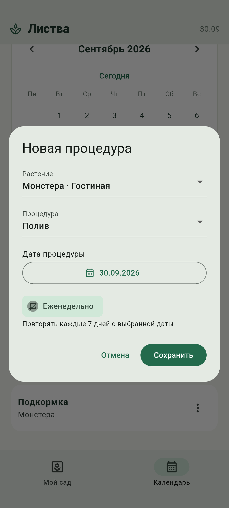

После сохранения серии в календаре выбран день следующей недели. Для этого дня отображается та же процедура с отметкой «Еженедельно». Выполнение отдельного полива не завершает будущие повторения: состояние выполнения хранится для каждой даты отдельно. Редактирование и удаление повторяющейся процедуры применяются ко всей серии, что поясняется в интерфейсе. Результат отображения следующего повторения представлен на рисунке 2.

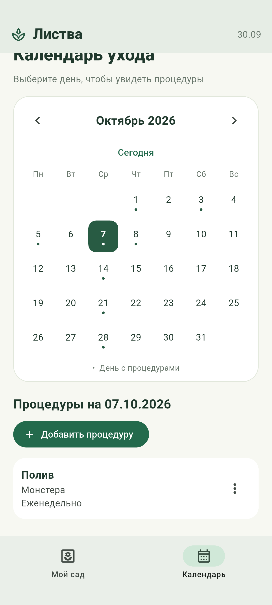

Для просмотра дополнительных сведений создан отдельный экран растения. Переход на него выполняется через действие «Справка и журнал ухода» на карточке каталога. На экране отображаются название, ботаническое имя и помещение. Условия содержания выводятся из записи растения, если пользователь ввёл их самостоятельно. При отсутствии такого текста используется локальный ботанический справочник, включённый в приложение в формате JSON. Он содержит сведения об освещении и влажности для 5 наименований растений. Поиск выполняется по ботаническому имени и допустимым вариантам названия. Сведения для монстеры, фикуса, спатифиллума и драцены подготовлены по материалам Королевского садоводческого общества, а общие условия для рода Aglaonema – по материалам Университета штата Северная Каролина. Название источника выводится вместе со справкой. Файл читается из ресурсов приложения без обращения к Интернету. При отсутствии подходящей записи предлагается ввести условия вручную или проверить название вида. Результат реализации справки для монстеры представлен на рисунке 3.

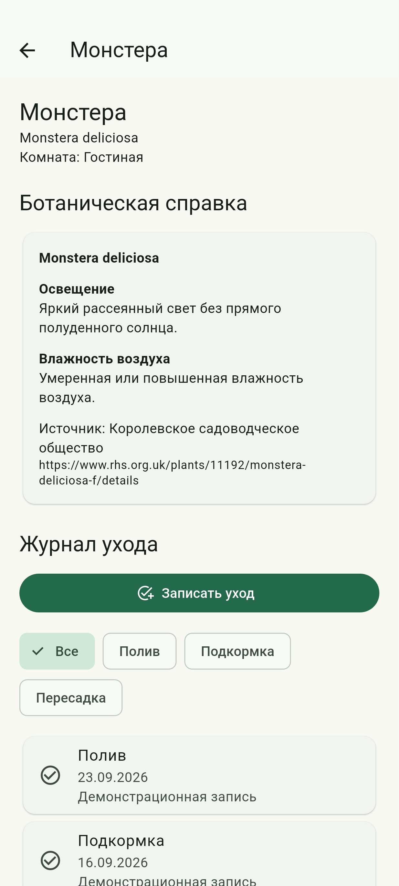

Для самостоятельного заполнения условий содержания в модель Plant добавлено строковое свойство careConditions. В форму добавления растения включено многострочное поле «Условия содержания». Введённый текст передаётся методу savePlant класса GardenViewModel, который удаляет пробелы по краям и проверяет ограничение в 2000 символов. При проверке создана аглаонема с указанием ботанического имени, комнаты, освещения и влажности воздуха. Результат заполнения формы представлен на рисунке 4.

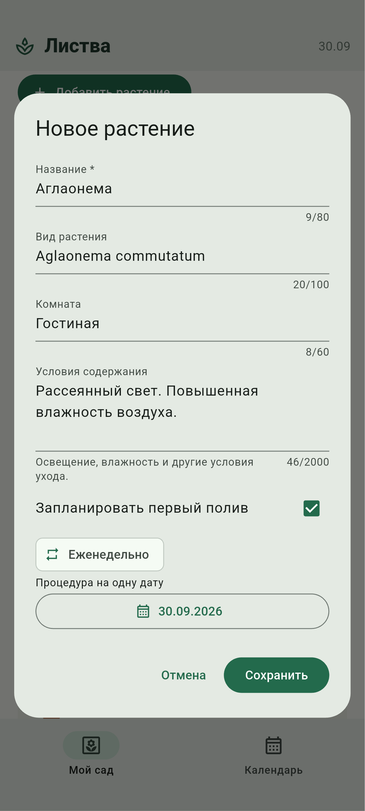

В форме редактирования используется то же поле. При открытии его управляющий объект TextEditingController получает ранее сохранённый текст, поэтому условия можно исправить без повторного ввода остальных сведений. После изменения текста вызывается savePlant с идентификатором существующего растения. Во время проверки к условиям добавлено указание о защите от прямых солнечных лучей. Результат редактирования представлен на рисунке 5.

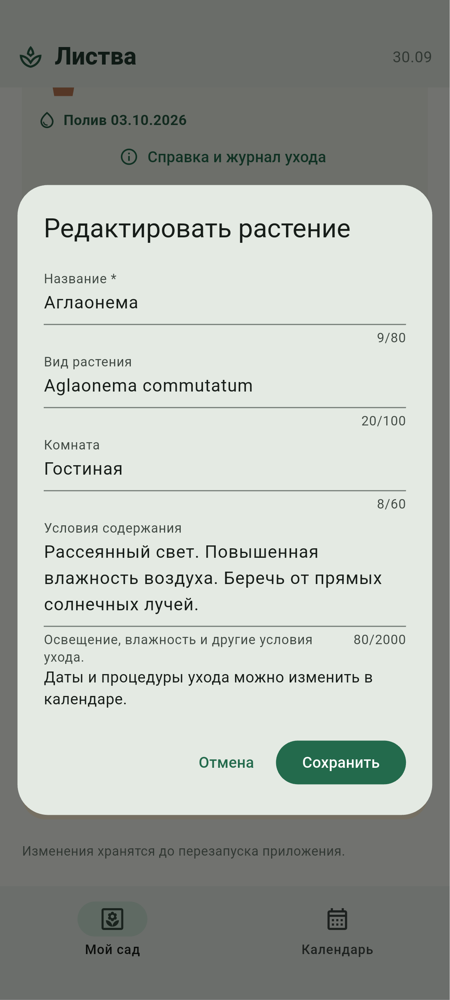

На детальном экране введённый текст имеет приоритет перед локальным справочником и сопровождается сообщением «Сведения введены пользователем». Если поле очистить, вновь используется справочник. Для сохранения условий при отметке полива и обновлении календаря свойство careConditions передаётся при подготовке актуальных объектов Plant. Таким образом, сведения о содержании не теряются при выполнении других действий с растением. Результат просмотра изменённой справки представлен на рисунке 6.

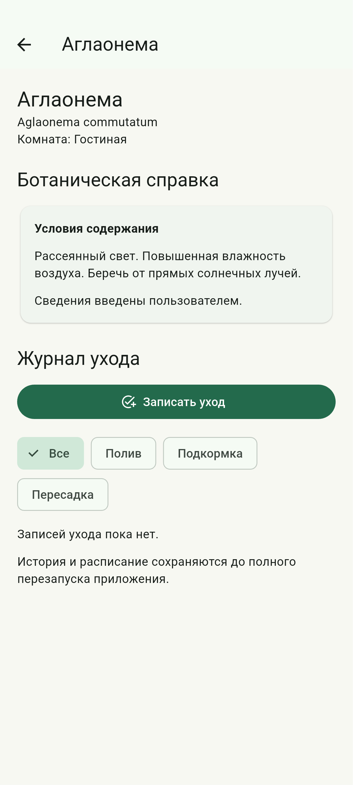


Для журнала создана самостоятельная модель фактически выполненной процедуры. Она содержит идентификатор растения, вид ухода, дату выполнения и примечание. История сортируется от более поздних записей к ранним. Данные журнала отделены от будущего расписания, поэтому удаление назначенной процедуры не удаляет сведения о ранее выполненном уходе. Начальные записи для демонстрации явно обозначены в интерфейсе. Результат просмотра истории поливов, подкормок и пересадок представлен на рисунке 7.

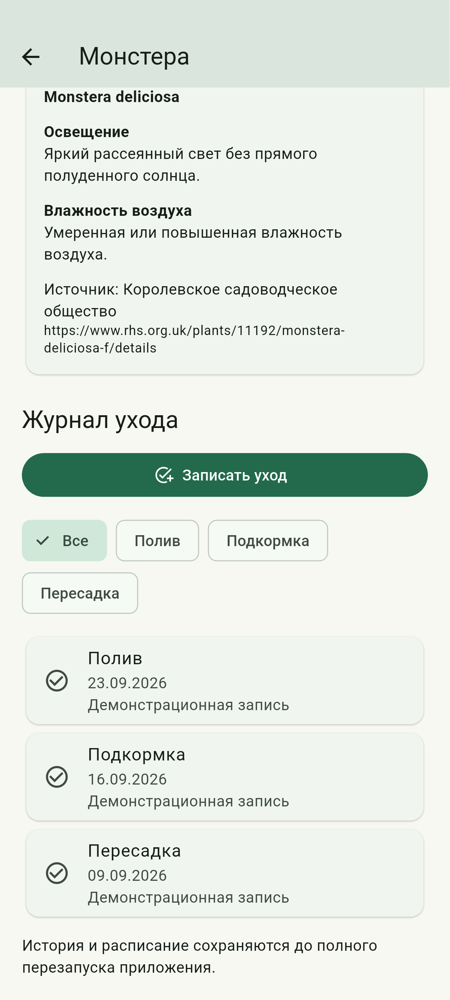

Для пополнения истории реализована форма «Записать уход». В форме выбираются вид процедуры и дата фактического выполнения, а также вводится примечание. Будущая дата недоступна для записи выполненного действия. Перед сохранением проверяется отсутствие одинакового вида ухода для этого растения за выбранный день. Сохранение полива закрывает соответствующие просроченные и сегодняшние назначения, сохраняя будущие даты. Результат ввода записи представлен на рисунке 8.

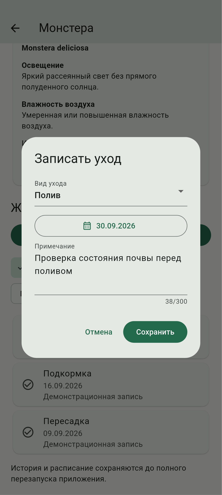

В журнал добавлен выбор вида процедуры. При выборе «Полив» отображаются только записи полива, а при выборе «Все» восстанавливается полный журнал. После сохранения новой записи изменения видны без повторного открытия экрана, поскольку модель представления уведомляет подписанное представление. Результат фильтрации с новой записью представлен на рисунке 9.

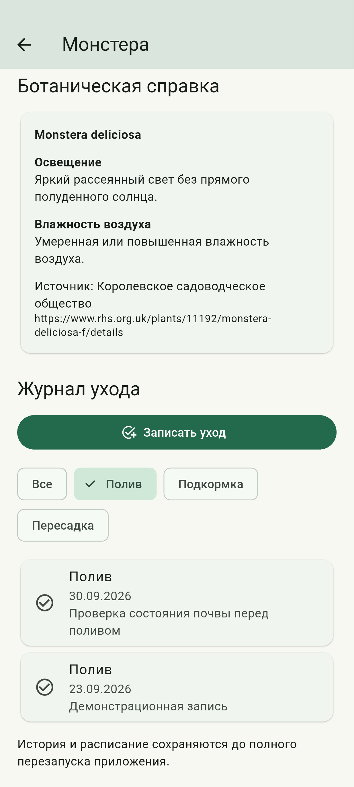

Для автоматизированного добавления создан экран распознавания этикетки. Пользователь может получить изображение через системную камеру, выбрать его из галереи либо использовать встроенный образец при работе в эмуляторе. Встроенные изображения содержат текстовые названия монстеры, фикуса и спатифиллума и проходят тот же распознаватель, что и снимок камеры. Набор источников изображения представлен на рисунке 10.

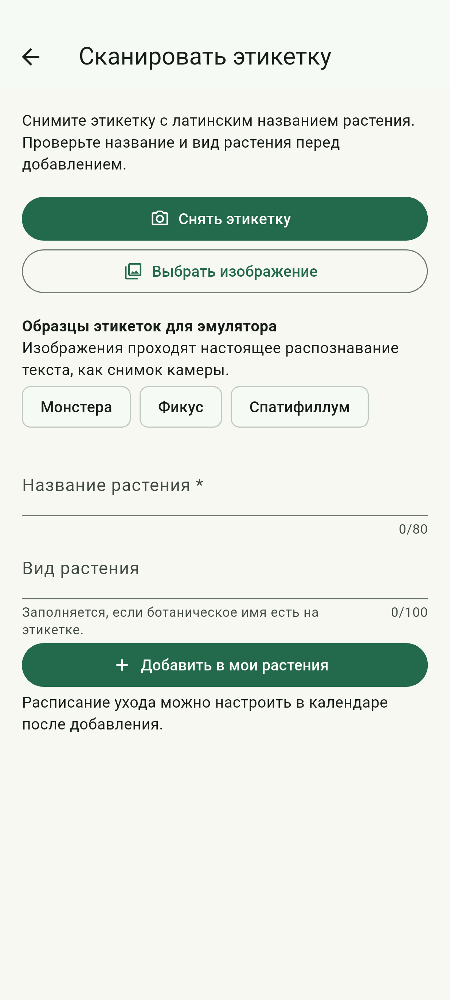

Распознавание выполняется на устройстве с помощью Google ML Kit. В текущей реализации используется распознавание латинского письма, поэтому для съёмки требуется этикетка с латинским ботаническим названием. Метод suggestName класса LabelScanViewModel выделяет название из полученного текста, отдавая приоритет известному ботаническому имени. При обработке остальных строк исключаются строки с цифрами, обозначениями валюты и служебными словами. Цена не переносится в поля и не выводится в интерфейсе. Метод suggestSpecies заполняет поле вида только при наличии ботанического имени на этикетке. Перед добавлением пользователь проверяет и при необходимости исправляет 2 поля: название и вид растения. Кнопка подтверждения передаёт в каталог только эти значения. Комната, условия содержания и даты процедур на основании изображения не определяются. Результат обработки изображения монстеры представлен на рисунке 11.

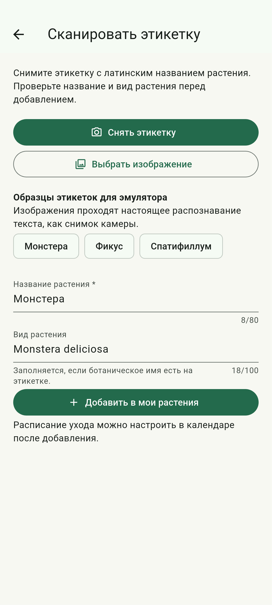

Для дополнительной проверки в галерею эмулятора помещены фотографии растений и этикеток. На фотографии горшка с аглаонемой напечатано только название рода AGLAONEMA. После выбора изображения определяется название «Аглаонема», а поле «Вид растения» остаётся пустым. Ботанический вид не подставляется из справочника, поскольку на изображении он отсутствует. Результат проверки представлен на рисунке 12.

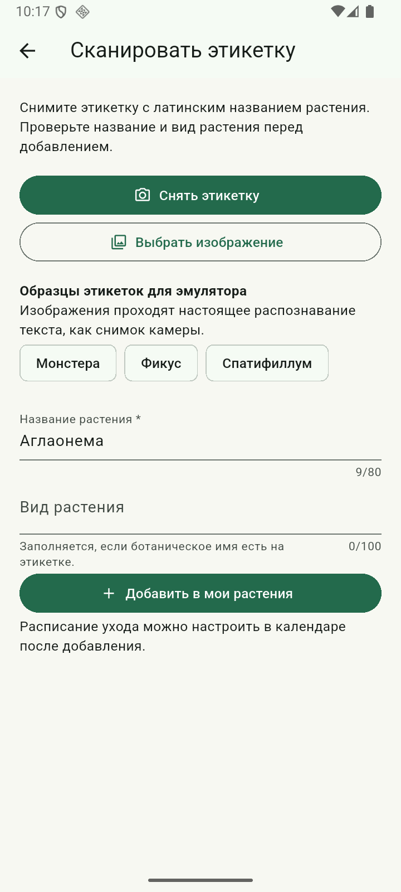

На другой фотографии этикетка содержит ботаническое имя Aglaonema commutatum. После обработки изображения заполнены название «Аглаонема» и соответствующий вид растения. Полученные данные доступны для исправления перед добавлением. После подтверждения условия содержания можно заполнить через форму редактирования растения. Результат распознавания этикетки с указанным видом представлен на рисунке 13.

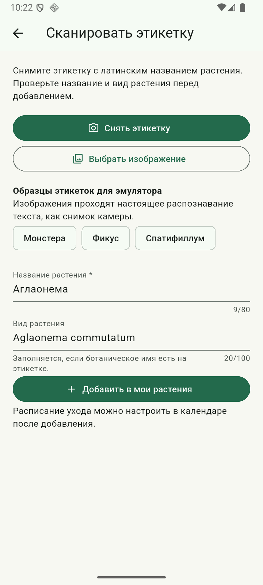


**Описание реализации:** модели Plant, CareProcedure, CareRecord и BotanicalProfile содержат данные предметной области. Класс GardenViewModel управляет каталогом, расписанием и историей. Класс PlantDetailViewModel подготавливает справку и отфильтрованный журнал, а LabelScanViewModel управляет состоянием распознавания, результатом и сообщениями об ошибках. Представления подписаны на изменения через ListenableBuilder. Источник справки и служба распознавания передаются через конструкторы, поэтому при автоматических проверках их можно заменить контролируемыми реализациями. Такое разделение уменьшает зависимость интерфейса от способа получения данных.

Ниже приведён фрагмент модели недельной процедуры. Дата начала ограничивает период повторений, а совпадение дня недели задаёт интервал в 7 календарных дней.

```dart
bool occursOn(DateTime day) {
  final start = dateOnly(date);
  final target = dateOnly(day);
  return sameDay(start, target) ||
      (weekly && !target.isBefore(start) && start.weekday == target.weekday);
}
```

Загрузка локального справочника осуществляется через службу AssetBotanicalRepository. Содержимое файла преобразуется в модели BotanicalProfile и повторно используется после первого чтения. Для сопоставления игнорируются регистр букв и пробелы по краям, затем проверяются вид и название растения. Это чтение включённых в приложение структурированных данных; постоянная база данных пока не используется.

```dart
return (jsonDecode(text) as List)
    .map((item) => BotanicalProfile.fromJson(item as Map<String, dynamic>))
    .toList();
```

Представление получает обновления состояния через ListenableBuilder. При изменении фильтра или сохранении записи вызывается notifyListeners, после чего перестраивается соответствующая часть детального экрана. Ниже приведён элемент интерфейса для выбора полного журнала. Обработчик передаёт действие модели представления, не изменяя список записей непосредственно в интерфейсе.

```dart
ChoiceChip(
  label: const Text('Все'),
  selected: model.filter == null,
  onSelected: (_) => model.selectFilter(null),
),
```

Следующий фрагмент класса PlantDetailViewModel показывает подготовку истории для представления. Записи выбираются по идентификатору растения и виду ухода, а затем сортируются по дате. Изменение фильтра уведомляет подписанное представление. Таким образом, правило выборки находится в модели представления, а построение элементов экрана выполняется в представлении.

```dart
List<CareRecord> get history =>
    garden.records
        .where(
          (r) => r.plantId == plantId &&
              (filter == null || r.type == filter),
        )
        .toList()
      ..sort((a, b) => b.performedOn.compareTo(a.performedOn));

void selectFilter(CareType? value) {
  filter = value;
  _changed();
}

void _changed() {
  if (!_disposed) notifyListeners();
}
```

Обработка изображения выполняется асинхронно на устройстве. Для выбора снимка используется image_picker, а для распознавания – google_mlkit_text_recognition. Модель распознавания включена в приложение, поэтому сетевой запрос не требуется. Во время распознавания действия временно недоступны, а интерфейс показывает индикатор выполнения. Полученный текст передаётся модели представления для выделения и подтверждения названия.

```dart
final result = await _recognizer.processImage(
  InputImage.fromFilePath(path),
);
return result.text;
```

**Результаты проверки:** статический анализ завершился без замечаний. 26 автоматических проверок охватывают календарные границы, недельные повторения, операции с растениями и процедурами, историю ухода, отмену полива, поиск ботанической справки, выделение названия без цены, заполнение вида только при наличии на этикетке, сохранение и редактирование условий содержания, а также приоритет пользовательской справки. Дополнительный сценарий в эмуляторе Android проверяет настоящее распознавание 3 встроенных изображений, создание серии, просмотр следующего повторения, ввод и фильтрацию записи журнала, добавление распознанного растения, ручной ввод и изменение условий содержания с последующим просмотром справки. Отдельно проверен выбор фотографий из системной галереи: изображение только с названием рода, этикетка с ботаническим видом и образец с ценой. Снимки получены из работающего приложения. Съёмка физической этикетки камерой реального телефона не проверялась.

**Ответы на контрольные вопросы:** в исходном задании второй лабораторной приведены вопросы о хранении данных. Ниже рассматриваются их принципы; использование перечисленных баз данных в текущем этапе не утверждается.

Лёгкое хранилище настроек, соответствующее назначению UserDefaults, используется для небольших значений, таких как логические признаки, строки и числовые настройки. Оно не заменяет базу данных для связанных растений, процедур и истории. Объёмные данные и частые изменения большого числа записей следует обрабатывать отдельным хранилищем.

Сериализация преобразует объект в представление, пригодное для хранения или передачи, а десериализация восстанавливает объект. Назначению Codable и Decodable в языке Dart соответствуют методы преобразования, например fromJson и toJson. Если название поля отличается от имени свойства, нужный ключ указывается явно при чтении словаря.

SQLite представляет данные в связанных таблицах и использует язык запросов SQL. Realm использует объектный подход с моделями и связями между объектами. Выбор между ними зависит от структуры данных, требований к запросам, поддерживаемых средств разработки и способа обновления схемы.

В SwiftData компонент ModelContainer определяет набор моделей и конфигурацию хранилища, а ModelContext обеспечивает операции с объектами и сохранение изменений. В адаптации для Flutter аналогичные обязанности разделяются между подключением к базе данных и службой доступа к данным. В текущем проекте обязанности источника данных выполняет состояние в оперативной памяти.

Связь одного растения с несколькими процедурами выражается идентификатором растения в каждой процедуре. В реляционной базе такая связь обычно обеспечивается внешним ключом. Каскадное удаление удаляет зависимые записи вместе с основной. В текущем проекте удаление растения явно удаляет его расписание и историю в GardenViewModel.

Миграция схемы требуется при изменении структуры сохранённых данных, например добавлении обязательного поля или изменении связи. При обновлении приложения преобразование существующих записей должно сохранить пользовательские сведения. Для текущего этапа миграция не требуется, поскольку постоянное хранилище ещё не создано.

Обёртка Query в SwiftUI связывает выборку хранилища с представлением. Во Flutter аналогичная задача решается запросом службы данных и подпиской представления на обновления. В проекте фильтрация истории выполняется в PlantDetailViewModel, а обновление виджетов происходит через ChangeNotifier.

Потокобезопасность предполагает согласованный доступ к данным и соблюдение ограничений используемого хранилища. Для длительных операций требуется асинхронная обработка и безопасная передача результата в состояние интерфейса. В проекте чтение справки и распознавание выполняются асинхронно; после закрытия экрана модель представления прекращает уведомлять представление.

Ленивая загрузка получает данные при обращении к ним, уменьшая объём одновременно загруженной информации. В проекте недельная серия вычисляет экземпляры только для запрошенного дня, а справочник читается при открытии соответствующего экрана. Это не является реализацией ленивой загрузки базы данных, но использует сходный принцип подготовки сведений по запросу.

Для защиты постоянного хранилища могут применяться шифрование базы данных и защищённое хранение ключа средствами платформы. Ключ нельзя хранить открыто рядом с зашифрованным файлом. В текущей лабораторной шифрование базы данных не реализуется.

Вывод: выполнена функциональная часть второй лабораторной работы для варианта 7. Созданы журнал поливов, подкормок и пересадок, справка об условиях содержания и распознавание текстового названия с этикетки. Условия содержания можно вводить и редактировать самостоятельно. По изображению заполняются только название и присутствующий на этикетке вид растения; цена не отображается. Дополнительно реализовано еженедельное повторение назначенных процедур. Модели, состояние приложения и интерфейс разделены в соответствии с архитектурой Model–View–ViewModel. Полученная структура подготовлена для добавления постоянного хранения на следующем этапе.
