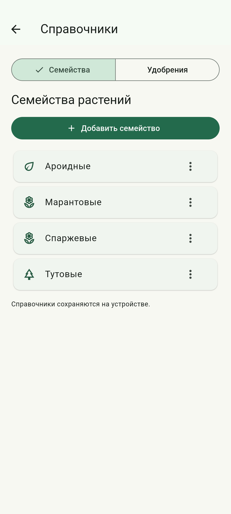
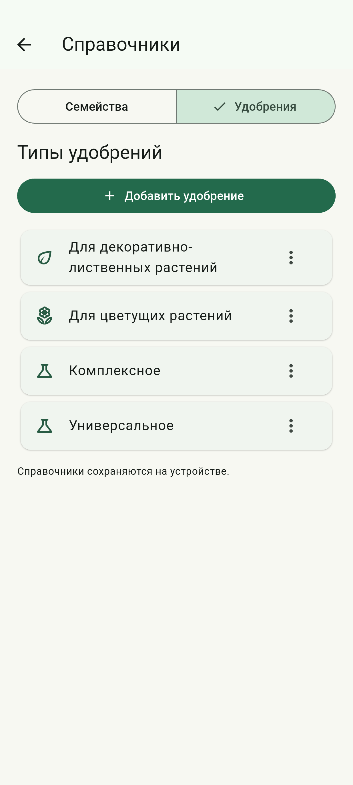
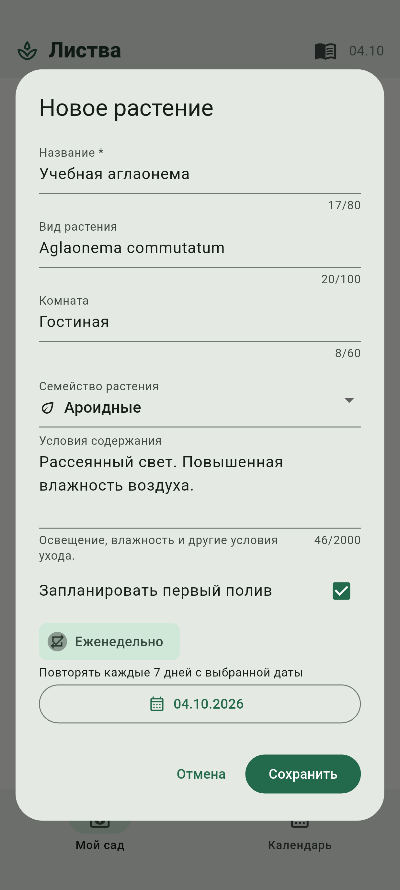
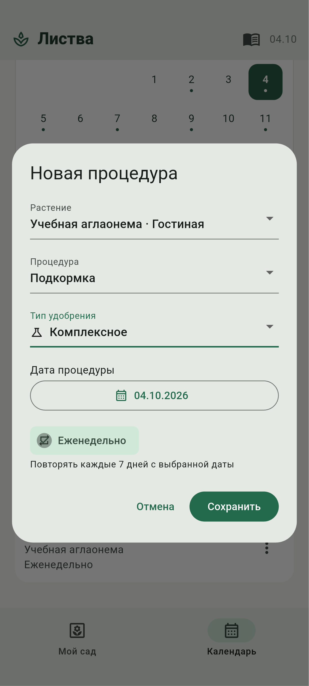
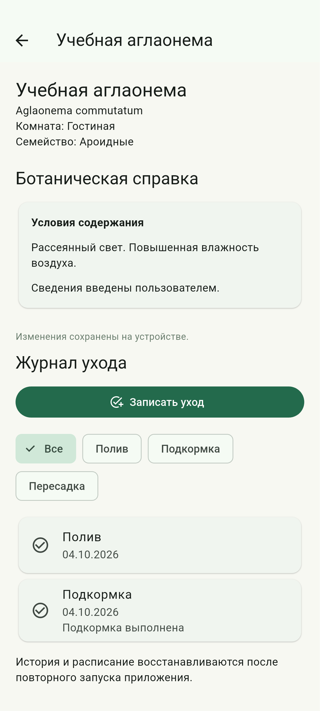
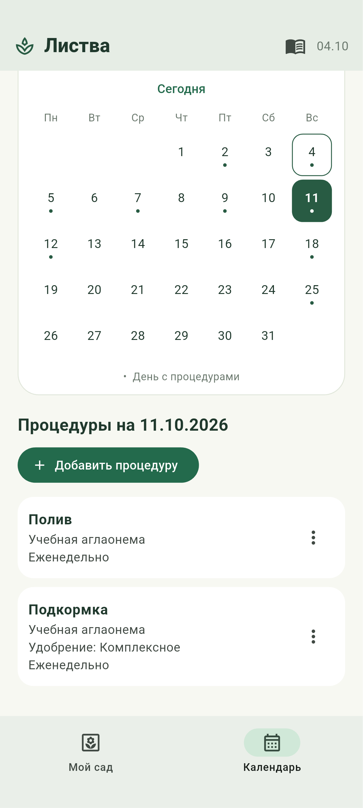
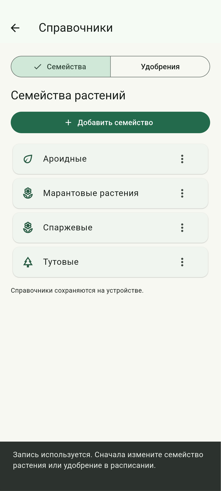
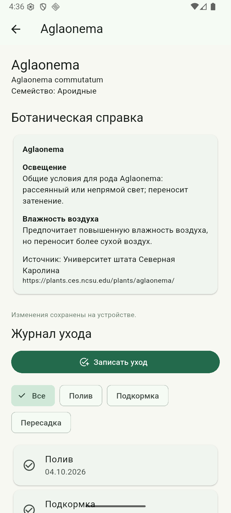

# Лабораторная работа №3

Механизмы сериализации, локального и долговременного хранения данных средствами Flutter.

Выполнил: студент группы ИТИ-41 Заяц М. С.

Принял: старший преподаватель Семенченя Т. С.

**Цель работы:** освоить сохранение состояния мобильного приложения и управление локальными данными, изучить сериализацию, реляционное и нереляционное хранение, реализовать восстановление коллекции растений и истории ухода после повторного запуска приложения.

**Задание:** выполнить часть варианта № 7 «Мобильный органайзер домашних растений», выделенную жёлтым цветом. Основная реляционная база должна хранить карточки растений, журнал выполненных процедур и расписание ухода. Вспомогательная нереляционная база должна содержать справочники семейств растений и типов удобрений. Для каждой записи справочника необходимо сохранять уникальный идентификатор, название и значок.

Проект выполнен на языке Dart с использованием Flutter. Для адаптации требований к выбранным средствам разработки применены SQLite через пакет sqflite и нереляционное хранилище Hive CE. SQLite выполняет роль основной базы данных, а Hive CE используется вместо указанного в первоначальном задании Realm. Постоянное хранение реализовано и проверено в приложении для Android. Репозиторий проекта размещён по адресу https://github.com/Jewilor/home-plants-organizer.

**Ход выполнения работы:** проанализирована структура приложения, подготовленного в предыдущих лабораторных работах. Сохранены каталог растений, календарь, журнал ухода, ручной ввод условий содержания и распознавание названия с этикетки. Для этих данных разработаны отдельные средства сохранения и восстановления. Сетевое получение справки и системные уведомления не относятся к выполненному этапу и в данной работе не используются.

Для основной базы подготовлен файл garden.sqlite в каталоге служебных данных приложения. Созданы таблицы plants, care_procedures, care_records, procedure_completions и settings. Карточка растения содержит название, вид, комнату, условия содержания, обозначение изображения и ссылку на семейство. Процедура содержит ссылку на растение, дату начала, вид ухода, признак еженедельного повторения, дату выполнения и ссылку на удобрение. В журнале хранится фактически выполненное действие, а не будущий план.

Связи растения с расписанием и журналом реализованы внешними ключами plant_id. Для них включено каскадное удаление. Отметки отдельных повторений связаны с процедурой через procedure_id; сочетание идентификатора процедуры и даты повторения образует составной первичный ключ. Ограничение UNIQUE в журнале запрещает повторную запись одинакового вида ухода для одного растения в один день. Перед работой с базой выполняется PRAGMA foreign_keys = ON.

Для вспомогательной базы созданы отдельные коллекции plant_families и fertilizer_types. Общая модель ReferenceEntry содержит поля id, name и icon. При записи объект преобразуется методом toMap в набор поддерживаемых значений, а при чтении восстанавливается методом fromMap. Значок сохраняется как имя элемента перечисления ReferenceIcon, поэтому сохранённая запись не зависит от устройства отображения. Для ввода названия и выбора значка разработана форма, представленная на рисунке 1.


Разработан экран «Справочники», который открывается кнопкой с изображением книги на главном экране. Раздел «Семейства» отображает записи в алфавитном порядке. После сохранения введённое семейство «Марантовые» появляется в списке. Данные сначала записываются в Hive CE, затем обновляется отображаемая коллекция. Результат добавления семейства представлен на рисунке 2.



В разделе «Удобрения» реализованы аналогичные операции добавления, изменения и удаления. При проверке создано удобрение «Комплексное» со значком питательных веществ. ReferenceViewModel удаляет пробелы по краям названия, проверяет допустимую длину и не допускает одинаковых названий в одном разделе без учёта регистра. Справочник типов удобрений после сохранения новой записи представлен на рисунке 3.



Форма добавления и редактирования растения дополнена выбором семейства. Элемент ReferenceSelector отображает название и значок, но возвращает устойчивый идентификатор записи. Этот идентификатор записывается в поле family_id таблицы plants. Переименование семейства не нарушает связь, поскольку название не используется в качестве ключа. Собственные условия содержания сохраняются в поле care_conditions. Форма заполнения карточки учебного растения представлена на рисунке 4.



Форма календарной процедуры дополнена выбором удобрения для подкормки. При выборе другого вида ухода ссылка на удобрение очищается. Признак «Еженедельно» сохраняется вместе с датой начала серии. На рисунке 5 представлена форма подкормки растения «Учебная аглаонема» с выбранным удобрением «Комплексное» и включённым еженедельным повторением.



Сохранение сада отделено от пользовательского интерфейса через GardenRepository. После изменения GardenViewModel создаёт объект GardenSnapshot с копиями коллекций растений, процедур, записей ухода и отметок повторений. Операции записи выполняются последовательно через цепочку Future, поэтому более позднее состояние не записывается раньше более раннего. Каждое состояние сохраняется в одной транзакции SQLite. При ошибке показывается сообщение с возможностью повторного сохранения; успешное завершение подтверждается надписью «Изменения сохранены на устройстве».

При нажатии «Полить сегодня» в журнал добавляется факт полива, а соответствующее повторение получает отметку выполнения. Для записи подкормки использована форма «Записать уход». Процедуры будущих дат остаются в расписании. На рисунке 6 представлены сохранённые условия содержания, выбранное семейство и журнал с выполненным поливом и подкормкой за 04.10.2026.



При запуске openGarden открывает обе базы, загружает справочники и получает сохранённый GardenSnapshot. Переданное состояние используется конструктором GardenViewModel для восстановления коллекций и счётчика идентификаторов. Начальные демонстрационные записи создаются только при отсутствии признака initialized. Пустая коллекция после удаления всех растений является сохранённым состоянием и не заменяется демонстрационными данными. Для проверки обе базы были закрыты и повторно открыты из тех же файлов. Восстановленная карточка представлена на рисунке 7.


Еженедельное расписание сохраняется как дата начала и признак повторения. Приложение вычисляет наличие процедуры для выбранного календарного дня, а не создаёт бесконечную последовательность записей. Отдельные выполненные повторения сохраняются в procedure_completions. После восстановления данных полив и подкормка 04.10.2026 остаются выполненными, а следующие повторения доступны 11.10.2026. Восстановленное расписание на следующую неделю представлено на рисунке 8.



Между SQLite и Hive CE отсутствует общий внешний ключ базы данных. Поэтому проверка ссылок выполнена в моделях состояния. Перед удалением семейства проверяются карточки растений, а перед удалением удобрения проверяется расписание. Пока основная база сохраняется либо её запись завершилась ошибкой, удаление справочника блокируется. Попытка удалить семейство «Ароидные», используемое учебным растением, завершилась сообщением, представленным на рисунке 9.



Запись справочника, на которую нет ссылок, удаляется после подтверждения пользователя. Для проверки из списка удалено ранее добавленное семейство «Марантовые растения». Сначала завершена операция delete в Hive CE, затем обновлено представление. Состояние справочника после удаления представлено на рисунке 10.


Для обновления структуры основной базы предусмотрена миграция с первой версии на вторую. Метод upgradeToVersionTwo добавляет поля family_id и fertilizer_id командами ALTER TABLE. Существующие карточки, журнал и расписание сохраняются. В отличие от удаления файла базы такой подход позволяет установить новую версию приложения поверх предыдущей без потери данных. Проверка миграции выполнялась на специально подготовленной базе первой версии.

Дополнительно проверена обычная сборка приложения версии 1.2.0, запущенная независимо от проверочного сценария. Через интерфейс добавлено растение Aglaonema, выбрано семейство «Ароидные», создано недельное расписание и записаны полив и подкормка. Затем процесс приложения был полностью остановлен средствами Android и запущен заново. До и после перезапуска сравнены строки всех таблиц SQLite и контрольные суммы файлов Hive CE. Значения совпали; восстановленное растение представлено на рисунке 11.



Для работы с основной базой написан SqliteGardenRepository. Метод load читает связанные таблицы в транзакции и преобразует строки в модели. Метод save согласует сохранённые записи с переданным состоянием. Существующие строки обновляются командой UPDATE, новые вставляются, отсутствующие удаляются. Замена родительских строк не применяется, чтобы не запускать каскадное удаление при обычном редактировании карточки. Календарные даты записываются как строки вида 2026-10-04 без времени суток и преобразования часового пояса.

Для хранения идентификаторов используются отдельные счётчики. Счётчик сада сохраняется в таблице settings вместе с остальными данными транзакции. Счётчик справочников находится в коллекции reference_metadata и резервируется до записи новой записи. После повторного запуска созданные объекты не получают идентификаторы уже существующих объектов. У справочников отдельно сохранён признак начального заполнения, поэтому намеренно удалённые записи не восстанавливаются автоматически.

Ниже приведены фрагменты программного кода текущей реализации. Отдельные полные файлы показывают открытие и миграцию основной базы, сохранение данных, работу вспомогательного справочника и преобразование моделей. Фрагменты модели состояния и формы выбора показывают связь хранения с пользовательским интерфейсом.

Состояние сада и преобразование календарных дат. Файл lib/models/garden_snapshot.dart.

```dart
import 'plant.dart';
import 'care_record.dart';

/// Согласованное состояние сада для сохранения и восстановления.
/// Копии коллекций защищают ожидающую записи операцию от последующих изменений.
class GardenSnapshot {
  GardenSnapshot({
    required Iterable<Plant> plants,
    required Iterable<CareProcedure> procedures,
    required Iterable<CareRecord> records,
    required Map<String, Map<DateTime, DateTime>> completions,
    required this.sequence,
  }) : plants = List.unmodifiable(plants),
       procedures = List.unmodifiable(procedures),
       records = List.unmodifiable(records),
       completions = Map.unmodifiable({
         for (final entry in completions.entries)
           entry.key: Map<DateTime, DateTime>.unmodifiable(entry.value),
       });
  final List<Plant> plants;
  final List<CareProcedure> procedures;
  final List<CareRecord> records;
  final Map<String, Map<DateTime, DateTime>> completions;
  final int sequence;
}

/// Сохраняет календарную дату без часового пояса и времени суток.
String encodeDay(DateTime date) =>
    dateOnly(date).toIso8601String().split('T').first;

/// Восстанавливает календарную дату из сохранённого текста.
DateTime decodeDay(String value) => dateOnly(DateTime.parse(value));
```

Модель записи вспомогательного справочника. Файл lib/models/reference_entry.dart.

```dart
/// Раздел вспомогательного справочника.
enum ReferenceKind { family, fertilizer }

/// Сохраняемые обозначения значков, независимые от Flutter.
enum ReferenceIcon { leaf, tree, flower, nutrients, water, sun }

/// Запись нереляционного справочника с устойчивым идентификатором.
class ReferenceEntry {
  const ReferenceEntry({
    required this.id,
    required this.name,
    required this.icon,
  });
  final String id;
  final String name;
  final ReferenceIcon icon;

  /// Преобразует запись в значения, поддерживаемые Hive.
  Map<String, Object> toMap() => {'id': id, 'name': name, 'icon': icon.name};

  /// Восстанавливает запись из нереляционного хранилища.
  factory ReferenceEntry.fromMap(Map<dynamic, dynamic> map) => ReferenceEntry(
    id: map['id'] as String,
    name: map['name'] as String,
    icon: ReferenceIcon.values.byName(map['icon'] as String),
  );
}
```

Основная база данных: схема, миграция, чтение и запись. Файл lib/services/sqlite_garden_repository.dart.

```dart
import 'package:sqflite/sqflite.dart';
import '../models/plant.dart';
import '../models/care_record.dart';
import '../models/garden_snapshot.dart';
import 'garden_repository.dart';

/// Основная реляционная база растений, расписания и выполненного ухода.
class SqliteGardenRepository implements GardenRepository {
  SqliteGardenRepository._(this.database);
  final Database database;
  static const schemaVersion = 2;

  /// Открывает базу и выполняет необходимые миграции схемы.
  static Future<SqliteGardenRepository> open({
    required String path,
    DatabaseFactory? factory,
  }) async {
    final db = await (factory ?? databaseFactory).openDatabase(
      path,
      options: OpenDatabaseOptions(
        version: schemaVersion,
        onConfigure: (db) => db.execute('PRAGMA foreign_keys = ON'),
        onCreate: (db, version) async {
          await createVersionOne(db);
          if (version >= 2) await upgradeToVersionTwo(db);
        },
        onUpgrade: (db, oldVersion, newVersion) async {
          if (oldVersion < 2) await upgradeToVersionTwo(db);
        },
      ),
    );
    return SqliteGardenRepository._(db);
  }

  /// Создаёт исходную схему. Отдельный метод позволяет проверить миграцию.
  static Future<void> createVersionOne(Database db) async {
    await db.execute('''CREATE TABLE plants (
      id TEXT PRIMARY KEY NOT NULL,
      name TEXT NOT NULL CHECK(length(trim(name)) BETWEEN 1 AND 80),
      species TEXT NOT NULL, room TEXT NOT NULL,
      care_conditions TEXT NOT NULL DEFAULT '', art INTEGER NOT NULL
    )''');
    await db.execute('''CREATE TABLE care_procedures (
      id TEXT PRIMARY KEY NOT NULL,
      plant_id TEXT NOT NULL REFERENCES plants(id) ON DELETE CASCADE,
      date TEXT NOT NULL,
      type TEXT NOT NULL CHECK(type IN ('watering','feeding','repotting')),
      weekly INTEGER NOT NULL CHECK(weekly IN (0,1)), completed_on TEXT
    )''');
    await db.execute('''CREATE TABLE care_records (
      id TEXT PRIMARY KEY NOT NULL,
      plant_id TEXT NOT NULL REFERENCES plants(id) ON DELETE CASCADE,
      type TEXT NOT NULL CHECK(type IN ('watering','feeding','repotting')),
      performed_on TEXT NOT NULL, note TEXT NOT NULL CHECK(length(note) <= 300),
      UNIQUE(plant_id, type, performed_on)
    )''');
    await db.execute('''CREATE TABLE procedure_completions (
      procedure_id TEXT NOT NULL REFERENCES care_procedures(id) ON DELETE CASCADE,
      occurrence_date TEXT NOT NULL, performed_on TEXT NOT NULL,
      PRIMARY KEY(procedure_id, occurrence_date)
    )''');
    await db.execute(
      'CREATE TABLE settings (key TEXT PRIMARY KEY, value TEXT NOT NULL)',
    );
    await db.execute(
      'CREATE INDEX procedures_by_plant ON care_procedures(plant_id, type)',
    );
    await db.execute(
      'CREATE INDEX records_by_plant ON care_records(plant_id, performed_on DESC)',
    );
  }

  /// Добавляет ссылки на справочники без удаления существующих данных.
  /// Ссылки между SQLite и Hive проверяются моделью состояния, а не SQL.
  static Future<void> upgradeToVersionTwo(Database db) async {
    await db.execute('ALTER TABLE plants ADD COLUMN family_id TEXT');
    await db.execute(
      'ALTER TABLE care_procedures ADD COLUMN fertilizer_id TEXT',
    );
  }

  @override
  Future<GardenSnapshot?> load() => database.transaction((txn) async {
    final settings = await txn.query('settings');
    final values = {
      for (final row in settings) row['key'] as String: row['value'] as String,
    };
    if (values['initialized'] != '1') return null;
    final plants = await txn.query('plants', orderBy: 'rowid');
    final procedures = await txn.query('care_procedures', orderBy: 'rowid');
    final records = await txn.query(
      'care_records',
      orderBy: 'performed_on DESC, rowid',
    );
    final completed = await txn.query('procedure_completions');
    final completions = <String, Map<DateTime, DateTime>>{};
    for (final row in completed) {
      completions.putIfAbsent(
        row['procedure_id'] as String,
        () => {},
      )[decodeDay(row['occurrence_date'] as String)] = decodeDay(
        row['performed_on'] as String,
      );
    }
    return GardenSnapshot(
      plants: plants.map(
        (row) => Plant(
          id: row['id'] as String,
          name: row['name'] as String,
          species: row['species'] as String,
          room: row['room'] as String,
          careConditions: row['care_conditions'] as String,
          familyId: row['family_id'] as String? ?? '',
          art: row['art'] as int,
        ),
      ),
      procedures: procedures.map(
        (row) => CareProcedure(
          id: row['id'] as String,
          plantId: row['plant_id'] as String,
          date: decodeDay(row['date'] as String),
          type: CareType.values.byName(row['type'] as String),
          weekly: row['weekly'] == 1,
          completedOn: row['completed_on'] == null
              ? null
              : decodeDay(row['completed_on'] as String),
          fertilizerId: row['fertilizer_id'] as String? ?? '',
        ),
      ),
      records: records.map(
        (row) => CareRecord(
          id: row['id'] as String,
          plantId: row['plant_id'] as String,
          type: CareType.values.byName(row['type'] as String),
          performedOn: decodeDay(row['performed_on'] as String),
          note: row['note'] as String,
        ),
      ),
      completions: completions,
      sequence: int.parse(values['sequence'] ?? '0'),
    );
  });

  /// Удаляет отсутствующие записи, обновляет существующие и вставляет новые.
  /// UPDATE сохраняет зависимые объекты, в отличие от замены родительской строки.
  Future<void> _syncTable(
    Transaction txn,
    String table,
    List<Map<String, Object?>> rows,
  ) async {
    final existing = (await txn.query(
      table,
      columns: ['id'],
    )).map((row) => row['id'] as String).toSet();
    final wanted = rows.map((row) => row['id'] as String).toSet();
    final batch = txn.batch();
    for (final id in existing.difference(wanted)) {
      batch.delete(table, where: 'id = ?', whereArgs: [id]);
    }
    for (final row in rows) {
      if (existing.contains(row['id'])) {
        batch.update(table, row, where: 'id = ?', whereArgs: [row['id']]);
      } else {
        batch.insert(table, row);
      }
    }
    await batch.commit(noResult: true);
  }

  @override
  Future<void> save(GardenSnapshot snapshot) =>
      database.transaction((txn) async {
        await _syncTable(txn, 'plants', [
          for (final p in snapshot.plants)
            {
              'id': p.id,
              'name': p.name,
              'species': p.species,
              'room': p.room,
              'care_conditions': p.careConditions,
              'art': p.art,
              'family_id': p.familyId.isEmpty ? null : p.familyId,
            },
        ]);
        await _syncTable(txn, 'care_procedures', [
          for (final p in snapshot.procedures)
            {
              'id': p.id,
              'plant_id': p.plantId,
              'date': encodeDay(p.date),
              'type': p.type.name,
              'weekly': p.weekly ? 1 : 0,
              'completed_on': p.completedOn == null
                  ? null
                  : encodeDay(p.completedOn!),
              'fertilizer_id': p.fertilizerId.isEmpty ? null : p.fertilizerId,
            },
        ]);
        await _syncTable(txn, 'care_records', [
          for (final r in snapshot.records)
            {
              'id': r.id,
              'plant_id': r.plantId,
              'type': r.type.name,
              'performed_on': encodeDay(r.performedOn),
              'note': r.note,
            },
        ]);
        await txn.delete('procedure_completions');
        final batch = txn.batch();
        for (final series in snapshot.completions.entries) {
          for (final occurrence in series.value.entries) {
            batch.insert('procedure_completions', {
              'procedure_id': series.key,
              'occurrence_date': encodeDay(occurrence.key),
              'performed_on': encodeDay(occurrence.value),
            });
          }
        }
        batch.insert('settings', {
          'key': 'sequence',
          'value': snapshot.sequence.toString(),
        }, conflictAlgorithm: ConflictAlgorithm.replace);
        batch.insert('settings', {
          'key': 'initialized',
          'value': '1',
        }, conflictAlgorithm: ConflictAlgorithm.replace);
        await batch.commit(noResult: true);
      });

  @override
  Future<void> close() => database.close();
}
```

Вспомогательная база данных и начальные справочники. Файл lib/services/hive_reference_repository.dart.

```dart
import 'package:hive_ce/hive.dart';
import '../models/reference_entry.dart';
import 'reference_repository.dart';

/// Хранит семейства и удобрения в отдельных коллекциях Hive CE.
class HiveReferenceRepository implements ReferenceRepository {
  HiveReferenceRepository._(this._families, this._fertilizers, this._metadata);
  final Box<Map> _families;
  final Box<Map> _fertilizers;
  final Box<dynamic> _metadata;

  /// Открывает коллекции и заполняет базовый справочник только при первом запуске.
  static Future<HiveReferenceRepository> open(String directory) async {
    Hive.init(directory);
    final families = await Hive.openBox<Map>('plant_families');
    Box<Map>? fertilizers;
    Box<dynamic>? metadata;
    try {
      fertilizers = await Hive.openBox<Map>('fertilizer_types');
      metadata = await Hive.openBox<dynamic>('reference_metadata');
      final repository = HiveReferenceRepository._(
        families,
        fertilizers,
        metadata,
      );
      if (metadata.get('initialized') != true) {
        await families.putAll({
          'family-aroids': const ReferenceEntry(
            id: 'family-aroids',
            name: 'Ароидные',
            icon: ReferenceIcon.leaf,
          ).toMap(),
          'family-mulberry': const ReferenceEntry(
            id: 'family-mulberry',
            name: 'Тутовые',
            icon: ReferenceIcon.tree,
          ).toMap(),
          'family-asparagus': const ReferenceEntry(
            id: 'family-asparagus',
            name: 'Спаржевые',
            icon: ReferenceIcon.flower,
          ).toMap(),
        });
        await fertilizers.putAll({
          'fertilizer-universal': const ReferenceEntry(
            id: 'fertilizer-universal',
            name: 'Универсальное',
            icon: ReferenceIcon.nutrients,
          ).toMap(),
          'fertilizer-leaves': const ReferenceEntry(
            id: 'fertilizer-leaves',
            name: 'Для декоративно-лиственных растений',
            icon: ReferenceIcon.leaf,
          ).toMap(),
          'fertilizer-flowers': const ReferenceEntry(
            id: 'fertilizer-flowers',
            name: 'Для цветущих растений',
            icon: ReferenceIcon.flower,
          ).toMap(),
        });
        await metadata.put('schema_version', 1);
        await metadata.put('sequence', 0);
        await metadata.put('initialized', true);
      }
      return repository;
    } catch (_) {
      await families.close();
      await fertilizers?.close();
      await metadata?.close();
      rethrow;
    }
  }

  Box<Map> _box(ReferenceKind kind) =>
      kind == ReferenceKind.family ? _families : _fertilizers;
  @override
  Future<List<ReferenceEntry>> load(ReferenceKind kind) async => [
    for (final value in _box(kind).values) ReferenceEntry.fromMap(value),
  ];

  @override
  Future<String> nextId(ReferenceKind kind) async {
    final sequence = _metadata.get('sequence', defaultValue: 0) as int;
    // Сначала резервируем номер: сбой следующей записи не создаст повторный ключ.
    await _metadata.put('sequence', sequence + 1);
    return '${kind.name}-$sequence';
  }

  @override
  Future<void> save(ReferenceKind kind, ReferenceEntry entry) =>
      _box(kind).put(entry.id, entry.toMap());
  @override
  Future<void> delete(ReferenceKind kind, String id) => _box(kind).delete(id);
  @override
  Future<void> close() async {
    if (_families.isOpen) await _families.close();
    if (_fertilizers.isOpen) await _fertilizers.close();
    if (_metadata.isOpen) await _metadata.close();
  }
}
```

Открытие баз и восстановление приложения. Файл lib/services/storage_bootstrap_native.dart.

```dart
import 'dart:io';
import 'package:path/path.dart' as path;
import 'package:path_provider/path_provider.dart';
import '../viewmodels/garden_view_model.dart';
import '../viewmodels/reference_view_model.dart';
import 'garden_resources.dart';
import 'sqlite_garden_repository.dart';
import 'hive_reference_repository.dart';

/// Открывает обе базы перед показом сада и сохраняет начальные записи один раз.
Future<GardenResources> openGarden({
  String? directoryPath,
  DateTime Function()? clock,
}) async {
  final directory = directoryPath == null
      ? await getApplicationSupportDirectory()
      : Directory(directoryPath);
  await directory.create(recursive: true);
  final repository = await SqliteGardenRepository.open(
    path: path.join(directory.path, 'garden.sqlite'),
  );
  HiveReferenceRepository? referenceRepository;
  ReferenceViewModel? references;
  GardenViewModel? garden;
  try {
    final catalogDirectory = Directory(
      path.join(directory.path, 'reference_catalog'),
    );
    await catalogDirectory.create(recursive: true);
    referenceRepository = await HiveReferenceRepository.open(
      catalogDirectory.path,
    );
    references = await ReferenceViewModel.load(referenceRepository);
    final saved = await repository.load();
    garden = GardenViewModel(
      repository: repository,
      references: references,
      snapshot: saved,
      clock: clock,
    );
    if (saved == null) await garden.persist();
    return GardenResources(
      garden,
      references: references,
      gardenRepository: repository,
      referenceRepository: referenceRepository,
    );
  } catch (_) {
    garden?.dispose();
    references?.dispose();
    await repository.close();
    await referenceRepository?.close();
    rethrow;
  }
}
```

Очередь сохранения в модели состояния. Файл lib/viewmodels/garden_view_model.dart.

```dart
  /// Ставит неизменяемый снимок в очередь: поздняя запись не обгоняет раннюю.
  void _saveChanged() {
    if (repository == null) {
      notifyListeners();
      return;
    }
    final state = snapshot;
    _pendingWrites++;
    storageError = null;
    notifyListeners();
    _writes = _writes
        .then((_) => repository!.save(state))
        .then(
          (_) {
            storageError = null;
          },
          onError: (Object error, StackTrace stack) {
            storageError =
                'Не удалось сохранить изменения. Повторите сохранение.';
          },
        )
        .whenComplete(() {
          _pendingWrites--;
          if (!_disposed) notifyListeners();
        });
  }

  /// Ожидает подтверждения всех поставленных в очередь операций.
  Future<void> flush() async {
    await _writes;
    if (storageError != null) throw StateError(storageError!);
  }

  /// Сохраняет текущее состояние, в том числе после устранимой ошибки хранилища.
  Future<void> persist() {
    _saveChanged();
    return flush();
  }
```

Сохранение и проверка удаления записи справочника. Файл lib/viewmodels/reference_view_model.dart.

```dart
  /// Сохраняет запись на устройстве до обновления отображаемого списка.
  Future<String> saveEntry({
    required ReferenceKind kind,
    String? id,
    required String name,
    required ReferenceIcon icon,
  }) async {
    if (saving) throw ArgumentError('Дождитесь сохранения справочника.');
    final clean = name.trim();
    if (clean.isEmpty || clean.length > 80) {
      throw ArgumentError('Введите название от 1 до 80 символов.');
    }
    if (id != null && find(kind, id) == null) {
      throw ArgumentError('Запись уже удалена.');
    }
    if (entries(kind).any(
      (entry) =>
          entry.id != id && entry.name.toLowerCase() == clean.toLowerCase(),
    )) {
      throw ArgumentError('Такое название уже есть в справочнике.');
    }
    saving = true;
    _emit();
    try {
      final entry = ReferenceEntry(
        id: id ?? await repository.nextId(kind),
        name: clean,
        icon: icon,
      );
      await repository.save(kind, entry);
      final list = kind == ReferenceKind.family ? _families : _fertilizers;
      final index = list.indexWhere((item) => item.id == entry.id);
      if (index < 0) {
        list.add(entry);
      } else {
        list[index] = entry;
      }
      return entry.id;
    } finally {
      saving = false;
      _emit();
    }
  }

  /// Не позволяет удалить семейство или удобрение, пока на него ссылается сад.
  Future<void> deleteEntry(ReferenceKind kind, String id) async {
    if (saving) throw ArgumentError('Дождитесь сохранения справочника.');
    if (_inUse?.call(kind, id) ?? false) {
      throw ArgumentError(
        'Запись используется. Сначала измените семейство растения или удобрение в расписании.',
      );
    }
    saving = true;
    _emit();
    try {
      await repository.delete(kind, id);
      (kind == ReferenceKind.family ? _families : _fertilizers).removeWhere(
        (entry) => entry.id == id,
      );
    } finally {
      saving = false;
      _emit();
    }
  }
```

Выбор семейства или удобрения по идентификатору. Файл lib/views/editors.dart.

```dart
/// Выбор записи справочника по идентификатору с возможностью снять связь.
class ReferenceSelector extends StatelessWidget {
  const ReferenceSelector({
    super.key,
    required this.model,
    required this.kind,
    required this.value,
    required this.onChanged,
  });
  final ReferenceViewModel model;
  final ReferenceKind kind;
  final String value;
  final ValueChanged<String> onChanged;
  @override
  Widget build(BuildContext context) => DropdownButtonFormField<String>(
    initialValue: value,
    isExpanded: true,
    decoration: InputDecoration(
      labelText: kind == ReferenceKind.family
          ? 'Семейство растения'
          : 'Тип удобрения',
    ),
    items: [
      const DropdownMenuItem(value: '', child: Text('Не выбрано')),
      if (value.isNotEmpty && model.find(kind, value) == null)
        DropdownMenuItem(value: value, child: const Text('Запись недоступна')),
      for (final entry in model.entries(kind))
        DropdownMenuItem(
          value: entry.id,
          child: Row(
            children: [
              Icon(referenceIcon(entry.icon), size: 18),
              const SizedBox(width: 8),
              Expanded(
                child: Text(
                  entry.name,
                  maxLines: 1,
                  overflow: TextOverflow.ellipsis,
                ),
              ),
            ],
          ),
        ),
    ],
    onChanged: (value) {
      if (value != null) onChanged(value);
    },
  );
}
```

Проверка выполнена автоматизированными проверками моделей, хранилищ и интерфейса, а также запуском на эмуляторе Android. Успешно завершены 35 проверок проекта. Проверены восстановление данных, сохранение пустой коллекции, каскадное удаление, откат транзакции при ошибке, миграция схемы, последовательность записи, повторное сохранение после ошибки, операции Hive CE, устойчивость идентификаторов и проверка используемых справочников. На эмуляторе отдельно выполнен сценарий работы двух баз через формы приложения. Анализ исходного кода не выявил ошибок. Собран и установлен новый установочный пакет приложения.

**Ответы на контрольные вопросы:**

Хранилище UserDefaults предназначено прежде всего для небольших настроек приложения. Оно поддерживает строки, числа, логические значения, даты, двоичные данные, массивы и словари допустимых типов. Произвольный объект необходимо предварительно преобразовать в поддерживаемые данные. Такое хранилище не предоставляет связей между сущностями, сложных выборок и общей транзакции для карточек и журнала. Универсальный допустимый объём для всех задач не задаётся; большие коллекции следует хранить в базе данных. В выполненном проекте настройки служебного состояния размещены в settings, а пользовательские данные сохраняются в SQLite и Hive CE.

Протокол Decodable определяет восстановление объекта из внешнего представления, Encodable определяет обратное преобразование, а Codable объединяет оба протокола. В Swift несовпадающие имена ключей и свойств задаются перечислением CodingKeys. В Dart соответствие задаётся явно в функциях преобразования. В данном проекте careConditions сопоставлено с care_conditions, familyId с family_id, а fertilizerId с fertilizer_id. ReferenceEntry.toMap и ReferenceEntry.fromMap выполняют сериализацию и восстановление записи справочника; отдельное преобразование всех данных в JSON для хранения в SQLite не требуется.

SQLite является реляционной базой данных: сведения размещаются в таблицах, связи и ограничения задаются схемой, выборки выполняются средствами SQL. Realm использует объектную модель, в которой программа работает с сохраняемыми объектами и связями через предоставленные библиотекой средства. В проекте выбран SQLite для связанных карточек и журнала, а вспомогательная нереляционная база реализована на Hive CE. Hive CE хранит пары ключей и значений и не является объектной заменой Realm с полностью одинаковыми возможностями.

В SwiftData компонент ModelContainer определяет схему моделей и конфигурацию постоянного хранилища. ModelContext управляет получением, добавлением, изменением, удалением и сохранением экземпляров моделей. В данном проекте аналогичные обязанности разделены между openGarden, SqliteGardenRepository и моделями состояния. Соединение Database выполняет транзакции, а GardenViewModel управляет состоянием приложения и направляет изменения на сохранение. Компоненты SwiftData в исходном коде Flutter не используются.

В SwiftData отношения описываются ссылками на модель либо коллекцией моделей; при необходимости задаётся Relationship с обратной связью и правилом удаления. Правило cascade удаляет зависимые объекты при удалении владельца. В реляционной базе связь одного объекта с несколькими реализуется внешним ключом в зависимой таблице. Для отношения одного объекта с одним дополнительно используется ограничение уникальности внешнего ключа. В данном проекте одно растение имеет несколько процедур и записей журнала. Их удаление обеспечивается REFERENCES plants(id) ON DELETE CASCADE.

Миграция схемы представляет собой переход сохранённых данных от прежней структуры к новой. Она необходима при добавлении, удалении либо изменении полей, связей и ограничений. Для SwiftData применяются версии схемы и план миграции. В SQLite проекта используется номер schemaVersion и обработчик onUpgrade. Переход с первой версии на вторую добавляет две ссылки на справочники и сохраняет содержимое прежних таблиц. Проверка миграции подтверждает сохранность карточки и служебного счётчика.

В SwiftUI обёртка Query получает модели SwiftData с заданным условием отбора и порядком сортировки, а изменение данных отражается в представлении. В данном проекте SQLite.query задаёт порядок чтения журнала по дате, затем модель детального экрана отбирает записи нужного растения и выбранного вида ухода. Представления Flutter подписаны на ChangeNotifier и обновляются через ListenableBuilder после notifyListeners. Прямой аналог Query с автоматически отслеживаемым запросом базы в этой реализации не применяется.

При работе Realm необходимо учитывать привязку управляемых объектов к потоку и передавать между потоками разрешённые ссылки либо независимые значения. В SwiftData операции следует выполнять в соответствующем контексте, а для выделенной работы с данными применяется ModelActor. В проекте Flutter изменяемое состояние принадлежит одному изоляту Dart. Неизменяемые снимки передаются в последовательную очередь асинхронных операций, а записи SQLite объединены транзакцией. Операции справочника ожидаются через await и блокируют повторное редактирование до завершения. Работа Hive CE из нескольких изолятов в проекте не реализована.

Отложенная загрузка означает получение объекта или его связанных данных при первом обращении вместо предварительной загрузки всей коллекции. Такой подход уменьшает начальные затраты оперативной памяти и время запуска при большом количестве записей. Для крупных списков дополнительно применяются ограничение размера выборки и последовательная загрузка частей списка. В данной учебной реализации небольшие коллекции загружаются целиком, поэтому отложенная загрузка объектов базы не заявляется. Недельные повторения календаря вычисляются по запросу для выбранной даты.

Защита локальной базы может включать шифрование файла базы либо отдельных конфиденциальных полей и безопасное хранение ключа. Для SQLite существуют средства шифрования, например SQLCipher; Realm поддерживает открытие зашифрованной базы с ключом. Hive CE предоставляет HiveAesCipher. На iOS ключ следует хранить средствами Keychain, на Android средствами Android Keystore, а не в исходном коде или обычных настройках. В данном проекте шифрование баз не включено; хранение в служебном каталоге приложения само по себе не является шифрованием.

Вывод: реализовано долговременное локальное хранение мобильного органайзера домашних растений. Реляционная база SQLite сохраняет карточки растений, журнал выполненного ухода, расписание и отметки недельных повторений. Нереляционное хранилище Hive CE сохраняет редактируемые справочники семейств и удобрений. Реализованы преобразование моделей, последовательное сохранение, миграция схемы и проверка связей между хранилищами. Автоматизированные проверки и полный перезапуск приложения на Android подтвердили восстановление сохранённых данных.
